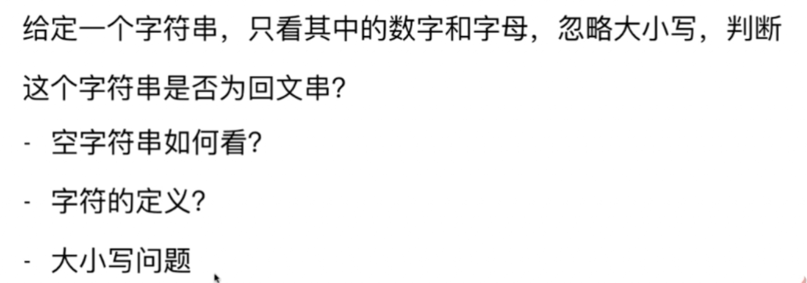

### 数组
#### 如何写出正确程序
1. 明确变量的含义
1. 循环不变量
1. 小数据量调试
1. 大数据量测试

#### 题目：
- [283. Move Zeroes](https://leetcode.com/problems/move-zeroes/description/)
- [27. Remove Element](https://leetcode.com/problems/remove-element/description/)

- [26. Remove Duplicates from Sorted Array](https://leetcode.com/problems/remove-duplicates-from-sorted-array/description/)
- [80. Remove Duplicates from Sorted Array II](https://leetcode.com/problems/remove-duplicates-from-sorted-array-ii/description/)

#### 基础算法思路的应用
- [75. Sort Colors](https://leetcode.com/problems/sort-colors/description/)
- [88. Merge Sorted Array](https://leetcode.com/problems/merge-sorted-array/)
- [215. Kth Largest Element in an Array](https://leetcode.com/problems/kth-largest-element-in-an-array/description/)
- 对撞指针
    - [167. Two Sum II - Input array is sorted](https://leetcode.com/problems/two-sum-ii-input-array-is-sorted/description/)
      
- [125. Valid Palindrome](https://leetcode.com/problems/valid-palindrome/description/)

- [344. Reverse String](https://leetcode.com/problems/reverse-string/description/)
- [345. Reverse Vowels of a String](https://leetcode.com/problems/reverse-vowels-of-a-string/description/)
- [11. Container With Most Water](https://leetcode.com/problems/container-with-most-water/description/)

