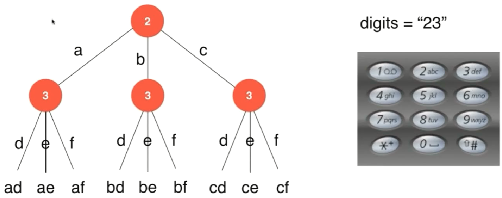
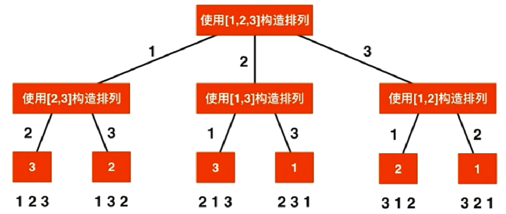

### 回溯法和递归

#### 树形问题——回溯和递归
- 暴力解法：循环、回溯
    - 回溯法是暴力解法的一个主要实现手段，当不能用简单循环时可以用回溯
- [17. Letter Combinations of a Phone Number](https://leetcode.com/problems/letter-combinations-of-a-phone-number/)

- [93. Restore IP Addresses](https://leetcode.com/problems/restore-ip-addresses/)
- [131. Palindrome Partitioning](https://leetcode.com/problems/palindrome-partitioning/)
- 回溯法的应用
    - 排列
- [46. Permutations](https://leetcode.com/problems/permutations/)

- [47. Permutations II](https://leetcode.com/problems/permutations-ii/)
- 回溯法的应用
    - 组合
- [77. Combinations](https://leetcode.com/problems/combinations/)
- [39. Combination Sum](https://leetcode.com/problems/combination-sum/)
- [40. Combination Sum II](https://leetcode.com/problems/combination-sum-ii/)
- [216. Combination Sum III](https://leetcode.com/problems/combination-sum-iii/)
- [78. Subsets](https://leetcode.com/problems/subsets/)
- [90. Subsets II](https://leetcode.com/problems/subsets-ii/)
- [401. Binary Watch](https://leetcode.com/problems/binary-watch/)
- 

