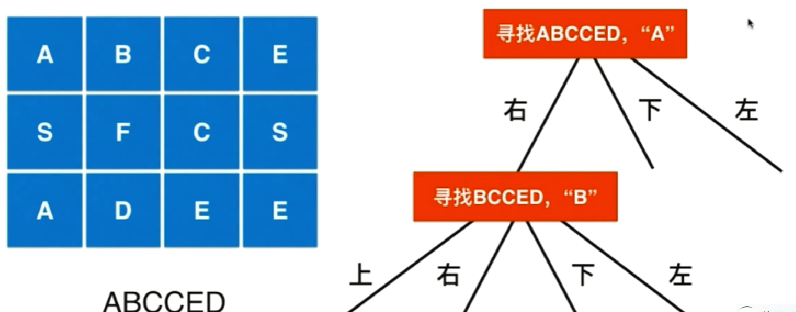
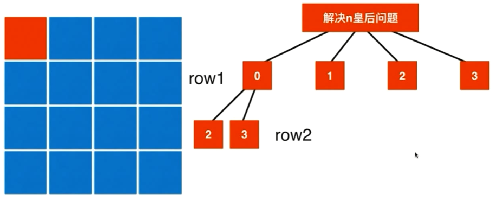
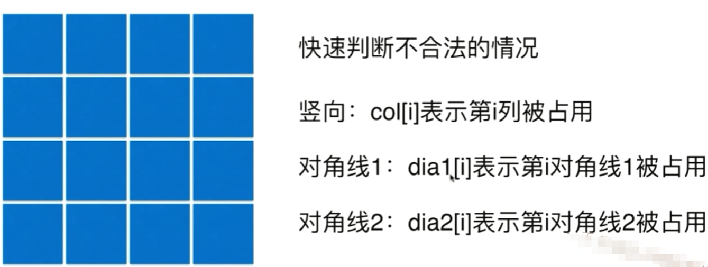
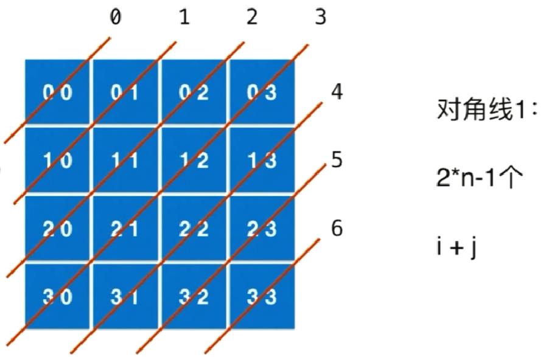
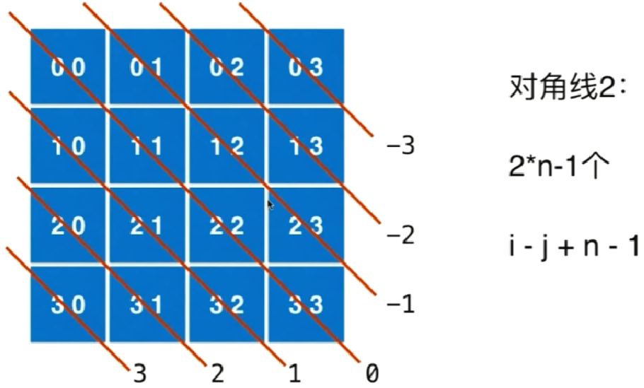

### 回溯法和递归

Backtracking（回溯）属于 DFS。

- 普通 DFS 主要用在 可达性问题 ，这种问题只需要执行到特点的位置然后返回即可。
- 而 Backtracking 主要用于求解 排列组合 问题，例如有 { 'a','b','c' } 三个字符，求解所有由这三个字符排列得到的字符串，这种问题在执行到特定的位置返回之后还会继续执行求解过程。

因为 Backtracking 不是立即返回，而要继续求解，因此在程序实现时，需要注意对元素的标记问题：

- 在访问一个新元素进入新的递归调用时，需要将新元素标记为已经访问，这样才能在继续递归调用时不用重复访问该元素；
- 但是在递归返回时，需要将元素标记为未访问，因为只需要保证在一个递归链中不同时访问一个元素，可以访问已经访问过但是不在当前递归链中的元素。

#### 树形问题——回溯和递归
- 暴力解法：循环、回溯
    - 回溯法是暴力解法的一个主要实现手段，当不能用简单循环时可以用回溯
- [17. Letter Combinations of a Phone Number](https://leetcode.com/problems/letter-combinations-of-a-phone-number/)

- [93. Restore IP Addresses](https://leetcode.com/problems/restore-ip-addresses/)
- [131. Palindrome Partitioning](https://leetcode.com/problems/palindrome-partitioning/)
- 回溯法的应用： [通用方法(Subsets, Permutations, Combination Sum, Palindrome Partioning)]("https://leetcode.com/problems/permutations/discuss/18239/A-general-approach-to-backtracking-questions-in-Java-(Subsets-Permutations-Combination-Sum-Palindrome-Partioning)")
    - 排列
- [46. Permutations](https://leetcode.com/problems/permutations/)

- [47. Permutations II](https://leetcode.com/problems/permutations-ii/)
- 回溯法的应用
    - 组合
- [77. Combinations](https://leetcode.com/problems/combinations/)
- [39. Combination Sum](https://leetcode.com/problems/combination-sum/)
- [40. Combination Sum II](https://leetcode.com/problems/combination-sum-ii/)
- [216. Combination Sum III](https://leetcode.com/problems/combination-sum-iii/)
- [78. Subsets](https://leetcode.com/problems/subsets/)
- [90. Subsets II](https://leetcode.com/problems/subsets-ii/)
- [401. Binary Watch](https://leetcode.com/problems/binary-watch/)
- 回溯法的应用
    - 二维平面上使用回溯法
- [79. Word Search](https://leetcode.com/problems/word-search/)

- floodfill 问题
- [200. Number of Islands](https://leetcode.com/problems/number-of-islands/)
- [130. Surrounded Regions](https://leetcode.com/problems/surrounded-regions/)
- 回溯法是经典的人工智能的基础
- [51. N-Queens](https://leetcode.com/problems/n-queens/) (注意剪枝)

