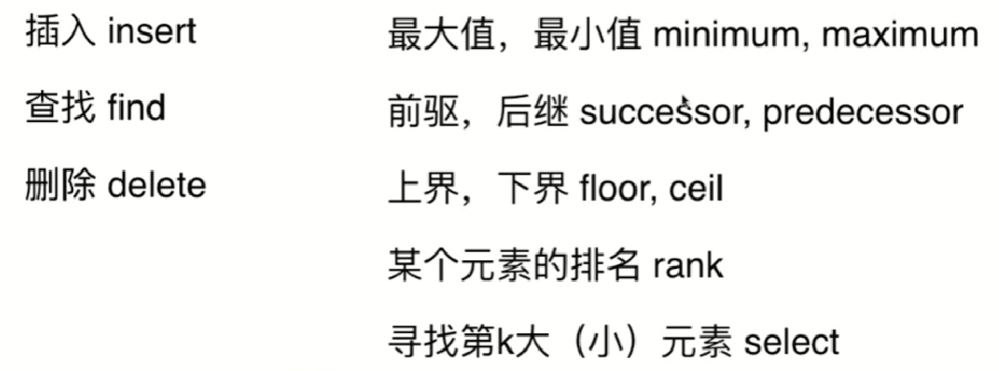

### 二叉树和递归

- [104. Maximum Depth of Binary Tree](https://leetcode.com/problems/maximum-depth-of-binary-tree/)
- **[111. Minimum Depth of Binary Tree](https://leetcode.com/problems/minimum-depth-of-binary-tree/)**
- [226. Invert Binary Tree](https://leetcode.com/problems/invert-binary-tree/)
- [100. Same Tree](https://leetcode.com/problems/same-tree/)
- [101. Symmetric Tree](https://leetcode.com/problems/symmetric-tree/)
- **[222. Count Complete Tree Nodes](https://leetcode.com/problems/count-complete-tree-nodes/)(完全二叉树（如堆）：除了最后一层，所有层节点数都达到最大，与此同时，最后一层所有节点都在左侧；满二叉树：所有层节点数都达到最大)**
- [110. Balanced Binary Tree](https://leetcode.com/problems/balanced-binary-tree/)(平衡二叉树：每个节点左右子树高度差都不超过1)
- [112. Path Sum](https://leetcode.com/problems/path-sum/)
- [113. Path Sum II](https://leetcode.com/problems/path-sum-ii/)
- **[437. Path Sum III](https://leetcode.com/problems/path-sum-iii/)**
- [64. Minimum Path Sum](https://leetcode.com/problems/minimum-path-sum/)
- [124. Binary Tree Maximum Path Sum](https://leetcode.com/problems/binary-tree-maximum-path-sum/)
- [404. Sum of Left Leaves](https://leetcode.com/problems/sum-of-left-leaves/)
- [257. Binary Tree Paths](https://leetcode.com/problems/binary-tree-paths/)
- [129. Sum Root to Leaf Numbers](https://leetcode.com/problems/sum-root-to-leaf-numbers/)
- 二分搜索树：每个节点键值大于左孩子、小于右孩子，且以左右孩子为根的子树仍为二分搜索树

    - **[235. Lowest Common Ancestor of a Binary Search Tree](https://leetcode.com/problems/lowest-common-ancestor-of-a-binary-search-tree/)**
    - **[236. Lowest Common Ancestor of a Binary Tree](https://leetcode.com/problems/lowest-common-ancestor-of-a-binary-search-tree/)**
    - [450. Delete Node in a BST](https://leetcode.com/problems/delete-node-in-a-bst/)
    - [108. Convert Sorted Array to Binary Search Tree](https://leetcode.com/problems/convert-sorted-array-to-binary-search-tree/)
    - [109. Convert Sorted List to Binary Search Tree](https://leetcode.com/problems/convert-sorted-list-to-binary-search-tree/)
    - [230. Kth Smallest Element in a BST](https://leetcode.com/problems/kth-smallest-element-in-a-bst/)
    - [236. Lowest Common Ancestor of a Binary Tree](https://leetcode.com/problems/lowest-common-ancestor-of-a-binary-tree/)
