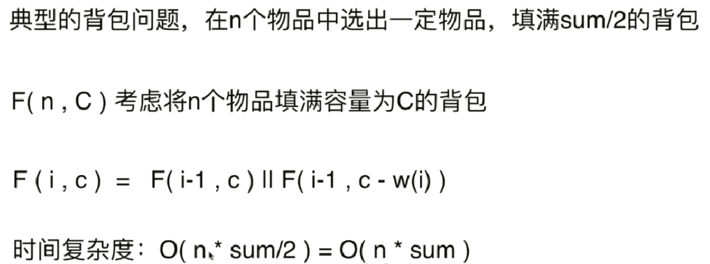
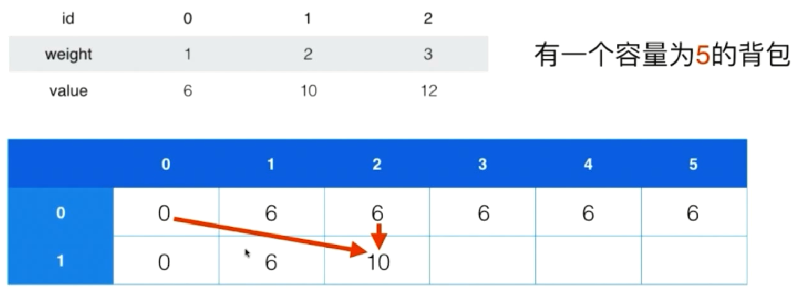
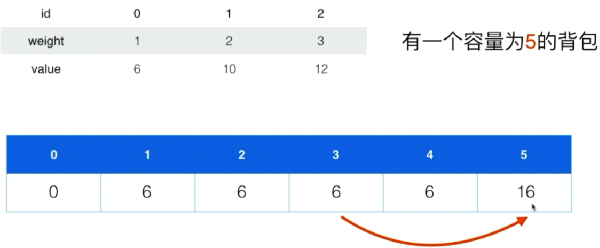
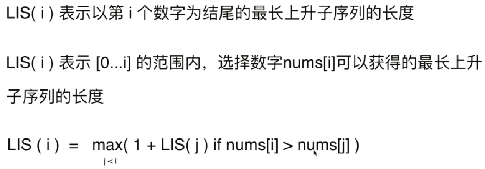
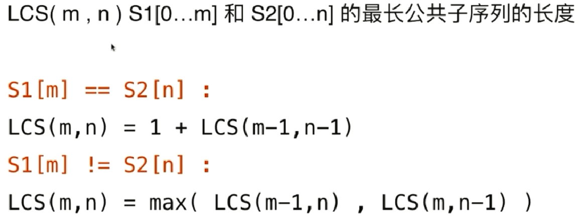
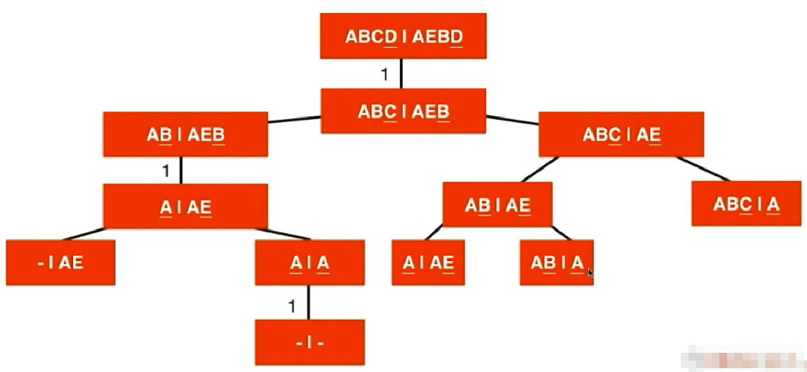

### 动态规划
> 将原问题拆解成若干子问题，同时保存子问题的答案，使得每个子问题只求解一次，最终获得原问题的答案


- 斐波那契数列：F(0)=1,F(1)=1,F(n)=F(n-1)+F(n-2)
    - [70. Climbing Stairs](https://leetcode.com/problems/climbing-stairs/)
    
    - [120. Triangle](https://leetcode.com/problems/triangle/)
    - [64. Minimum Path Sum](https://leetcode.com/problems/minimum-path-sum/)


```c
//记忆化搜索
vector<int> memo;
int fib(int n){
    if(n == 0){
        return 0;
    }
    if(n == 1){
        return 1;
    }
    if(memo[n] == -1){
        memo[n] = fib(n-1) + fib(n-2);
    }
    return memo[n];
}

//动态规划
int fib(int n){
    vector<int> memo(n+1, -1);
    memo[0] = 0;
    memo[1] = 1;
    for(int i = 2; i <= n; i++){
        memo[i] = memo[i-1] + memo[i-2];
    }
    return memo[n];
}
```
- 最优子结构：通过求子问题的最优解，可以获得原问题的最优解

- [343. Integer Break](https://leetcode.com/problems/integer-break/)
- [279. Perfect Squares](https://leetcode.com/problems/perfect-squares/)
- [91. Decode Ways](https://leetcode.com/problems/decode-ways/)
- [62. Unique Paths](https://leetcode.com/problems/unique-paths/)
- [63. Unique Paths II](https://leetcode.com/problems/unique-paths-ii/)
- 状态转移和状态方程
    - [198. House Robber](https://leetcode.com/problems/house-robber/)（暴力解法：检查房子所有组合，对每个房子检查是否相邻，没有则记录最大值。O((2^n)*n)）
    
    
    - 不同的状态定义
    
- [213. House Robber II](https://leetcode.com/problems/house-robber-ii/)
递归树中每个节点所表示要解决的问题在DP里表示定义的一个状态
- [337. House Robber III](https://leetcode.com/problems/house-robber-iii/)
- [309. Best Time to Buy and Sell Stock with Cooldown](https://leetcode.com/problems/best-time-to-buy-and-sell-stock-with-cooldown/)
- [122. Best Time to Buy and Sell Stock II](https://leetcode.com/problems/best-time-to-buy-and-sell-stock-ii/)
- [416. Partition Equal Subset Sum](https://leetcode.com/problems/partition-equal-subset-sum/)
    
- [322. Coin Change](https://leetcode.com/problems/coin-change/)
- [377. Combination Sum IV](https://leetcode.com/problems/combination-sum-iv/)
- [474. Ones and Zeroes](https://leetcode.com/problems/ones-and-zeroes/)
- [139. Word Break](https://leetcode.com/problems/word-break/)
- [494. Target Sum](https://leetcode.com/problems/target-sum/)
- 0-1背包问题 (暴力解法：每个物品可放进背包也可不放，O((2^n)*n))
  
  - 时间复杂度：O(n * C); 空间复杂度：O(n * C)
  
  - 空间复杂度优化
    - 两行：第i行元素只依赖第i-1行元素，理论上只需要保持两行元素，即 O(2 * C)=O(C)
    
    - 一行：只看上面和左面
    
- 0-1背包问题变种
    - 完全背包问题：每个物品可以无限使用（完全背包只需要将 0-1 背包的逆序遍历 dp 数组改为正序遍历即可，参考 M322_CoinChange）
    - 多重背包问题：每个物品不止一个，有 num(i) 个
    - 多维费用背包问题：考虑物品的体积和重量（三维数组）
    - 物品间加入更多约束：物品间可以互相排斥，也可以互相依赖
- LIS：最长上升子序列
- [300. Longest Increasing Subsequence](https://leetcode.com/problems/longest-increasing-subsequence/)
    
- LCS：最长公共子序列
    
    
- dijkstra 单源最短路径算法也是动态规划
