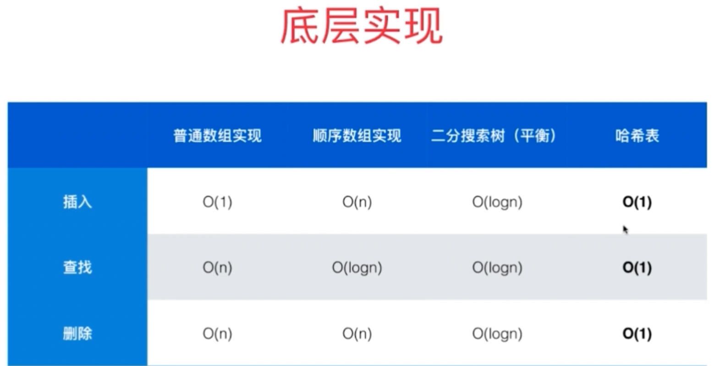
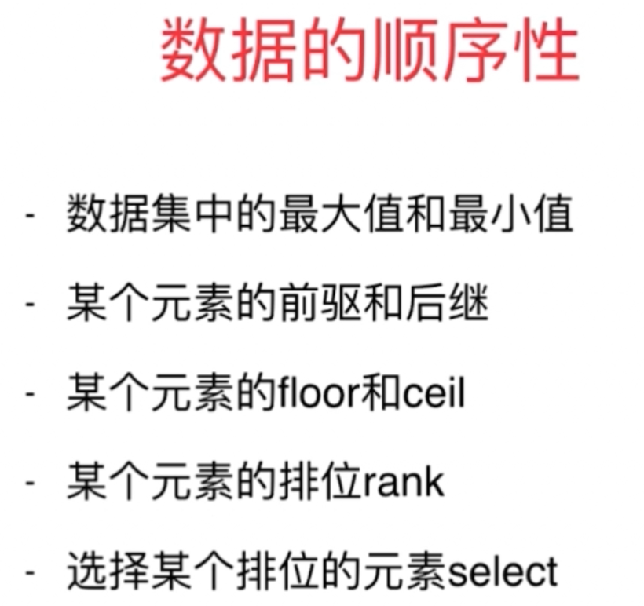

### 查找表

#### 两类查找问题
- 查找有无（元素'a'是否存在？）：set；集合
- 查找对应关系（元素'a'出现了几次？）：map；字典

- 哈希表缺点：失去数据的顺序性
    - c++ 中 set 和 map 底层实现为平衡二叉树
    - unordered_set 和 unordered_map 底层实现为哈希表

#### 题目：
- [349. Intersection of Two Arrays](https://leetcode.com/problems/intersection-of-two-arrays/description/)
- [350. Intersection of Two Arrays II](https://leetcode.com/problems/intersection-of-two-arrays-ii/description/)
- [242. Valid Anagram](https://leetcode.com/problems/valid-anagram/)
- [202. Happy Number](https://leetcode.com/problems/happy-number/)
- [290. Word Pattern](https://leetcode.com/problems/word-pattern/)
- [205. Isomorphic Strings](https://leetcode.com/problems/isomorphic-strings/)
- [451. Sort Characters By Frequency](https://leetcode.com/problems/sort-characters-by-frequency/)
- [1. Two Sum](https://leetcode.com/problems/two-sum/)
- [15. 3Sum](https://leetcode.com/problems/3sum/)
- [18. 4Sum](https://leetcode.com/problems/4sum/)
- [16. 3Sum Closest](https://leetcode.com/problems/3sum-closest/)
- [454. 4Sum II](https://leetcode.com/problems/4sum-ii/)
- [49. Group Anagrams](https://leetcode.com/problems/group-anagrams/)
- [447. Number of Boomerangs](https://leetcode.com/problems/number-of-boomerangs/)
- [149. Max Points on a Line](https://leetcode.com/problems/max-points-on-a-line/)
- 滑动窗口 + 查找表
    - [219. Contains Duplicate II](https://leetcode.com/problems/contains-duplicate-ii/)
    - [217. Contains Duplicate](https://leetcode.com/problems/contains-duplicate/)
    - [220. Contains Duplicate III](https://leetcode.com/problems/contains-duplicate-iii/)
