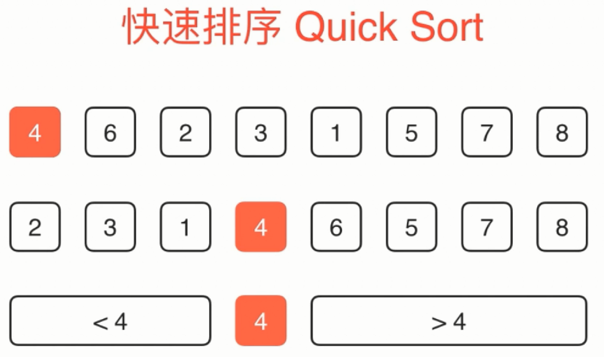
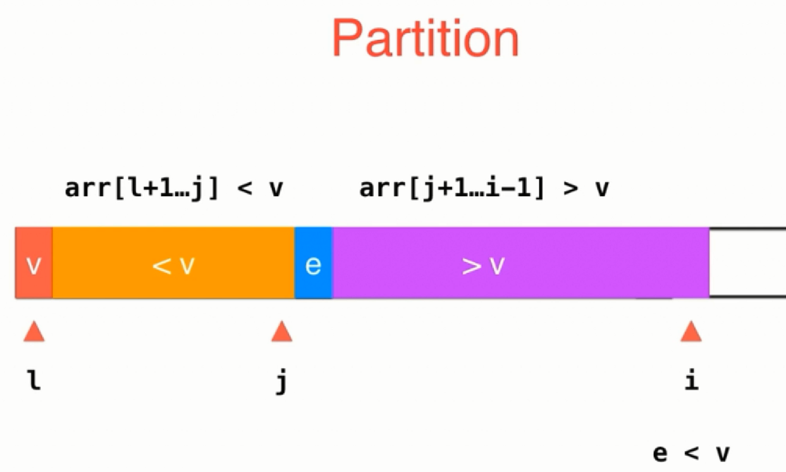
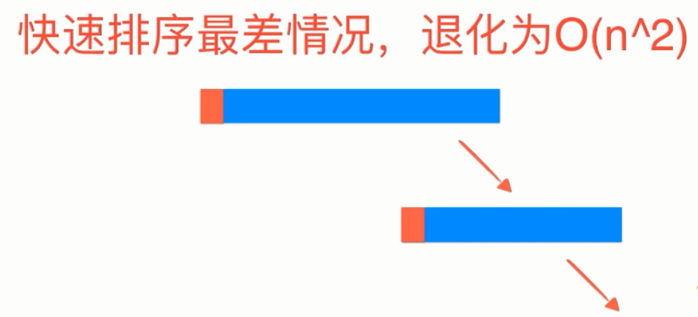
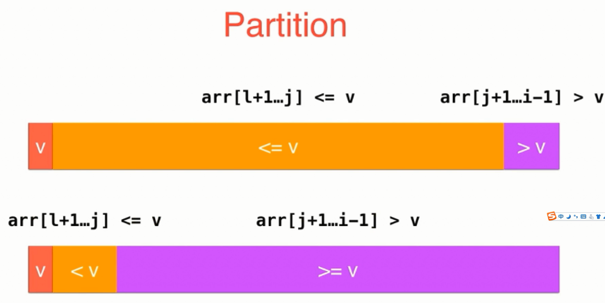
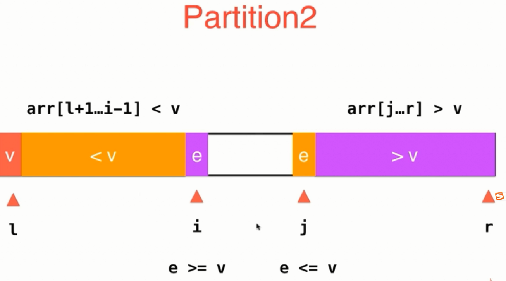
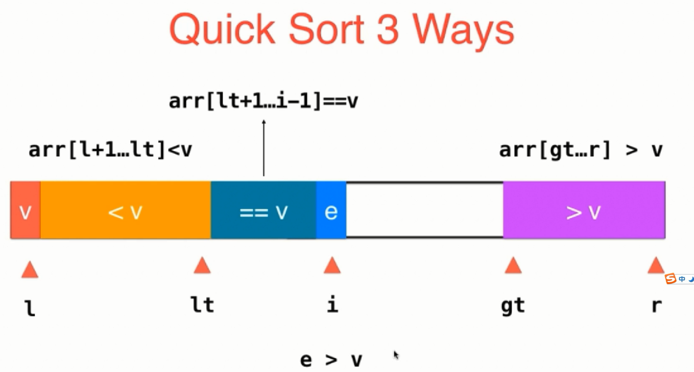
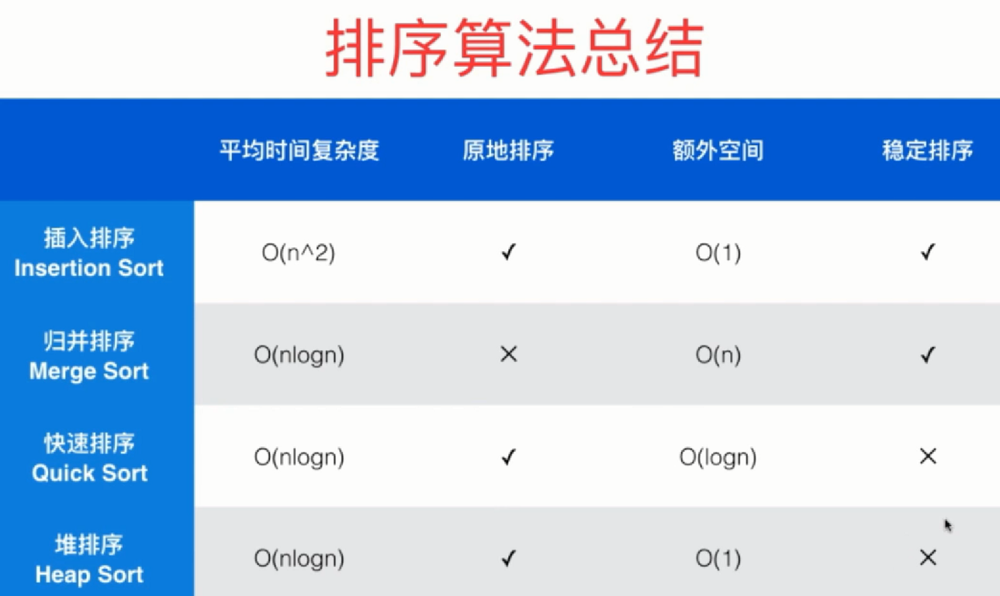

## 排序

### 快排

#### partition

#### 快排最坏退化到O(N * N)

#### 快排大量重复元素：数据倾斜

##### 解决方案1：双路快排

#### 解决方案2：三路快排

> 元素相等时三路快排不进行递归，可节省时间

### 其它
归并排序和快排都是分治思想

- 归并排序求逆序对数：O(NlogN)
- 快排思想求数组第n大元素：O(N)
> 算法复杂度 = N + N/2 + N/4 + N/8 +...+ 1 = O(N)，注意这里采用随机化思想，可以保证期望值是平分的

### 排序总结

- 注意：快排采用递归方式进行排序，递归过程一共有 logN 层，共需要 logN 层栈空间保存每次递归的临时变量供递归返回时使用
- 归并通过递归实现，实际为 O(N+logN)
- 稳定排序类库通常选择归并排序