### 算法面试

#### 合理的思考路径

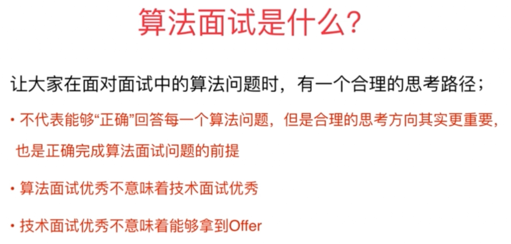

##### 思考：对一组数据排序

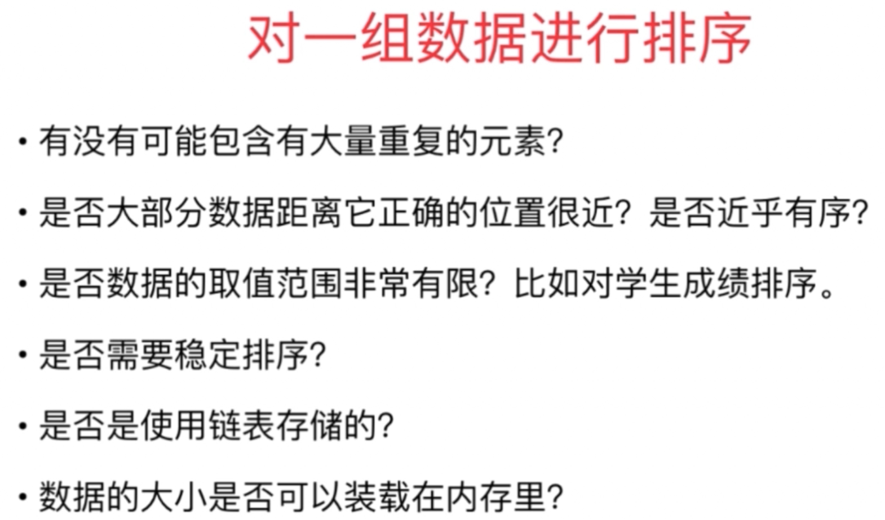

- 正确答案
    - 正确
    - 对问题独到见解
    - 优化
    - 代码规范
    - 容错性

#### 算法面试优秀不意味着技术面试优秀

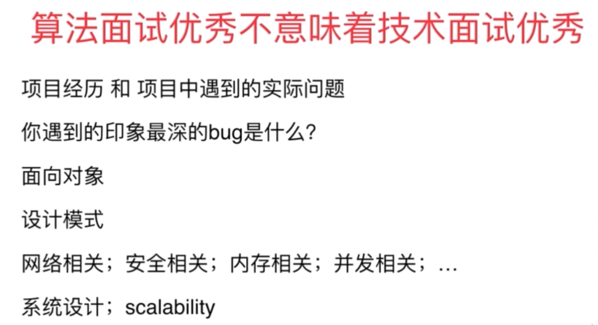

##### 技术面试不仅考察技术水平，还在了解面试者的过去以及形成的思考行为方式
- 过去：项目经历
- 思考行为方式
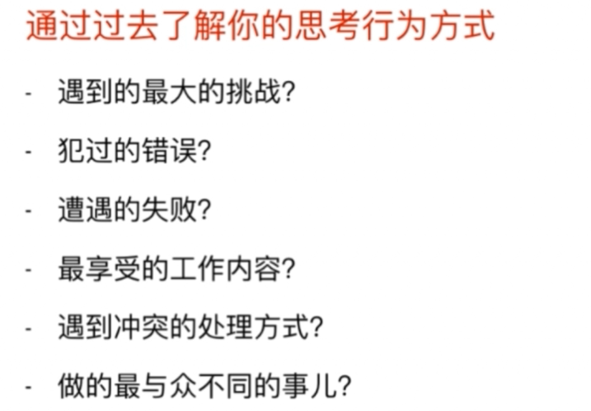

- 问面试官的问题
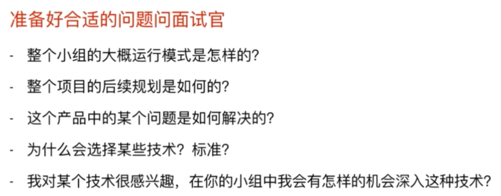

##### 算法面试准备注意

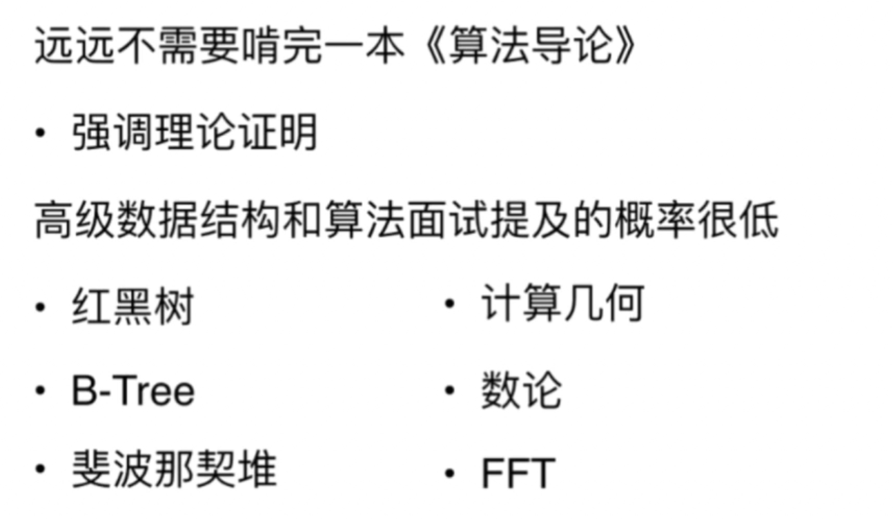

##### 准备范围

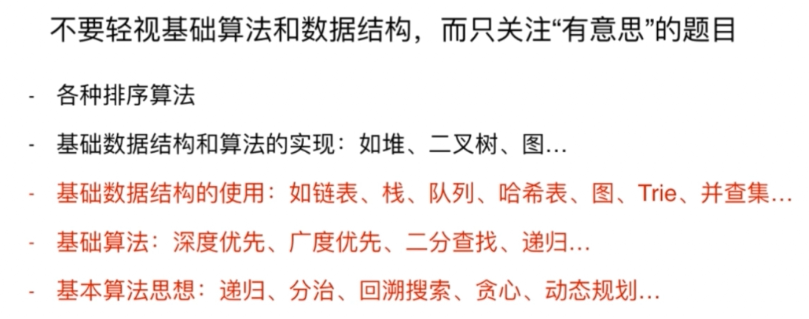

##### 解决算法题思路

1. 注意题目条件
    - 给定一个有序数组
    - 设计一个O(NlogN)算法(logN-->分治)
    - 无需考虑额外空间
    - 数据规模10000（可O(N*N)，O(NlogN)可处理百万级或千万级）
1. 自己设置简单测试用例
1. 不能忽视暴力解法
1. 优化算法
    1. 遍历常见算法思路
    1. 遍历商检数据结构
    1. 空间换时间（哈希表）
    1. 预处理信息（排序）
    1. 瓶颈处寻找答案 O(NlogN)+O(N * N); O(N * N * N)
1. 实际编写算法
    1. 极端条件判断
        - 数组为空？字符串为空？数量为0？指针为null？
        - 变量名
        - 模块化，复用性
1. 对于基本问题，白板编程

### 时间复杂度

#### 什么是大O

n 表示数据规模，O(f(n))表示运行算法所需要执行的指令数，和f(n)成正比
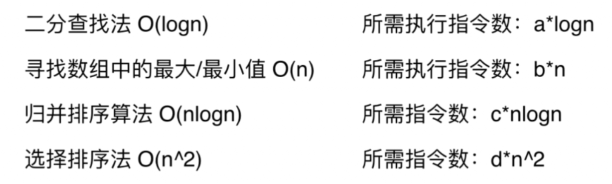
> 学术界，严格讲O(f(n))表示算法执行的上界；归并排序是O(NlogN)也是O(N*N)；业界就用O表示算法最低上界

- 对邻接表实现图遍历O(V+E)

#### 复杂的时间复杂度计算

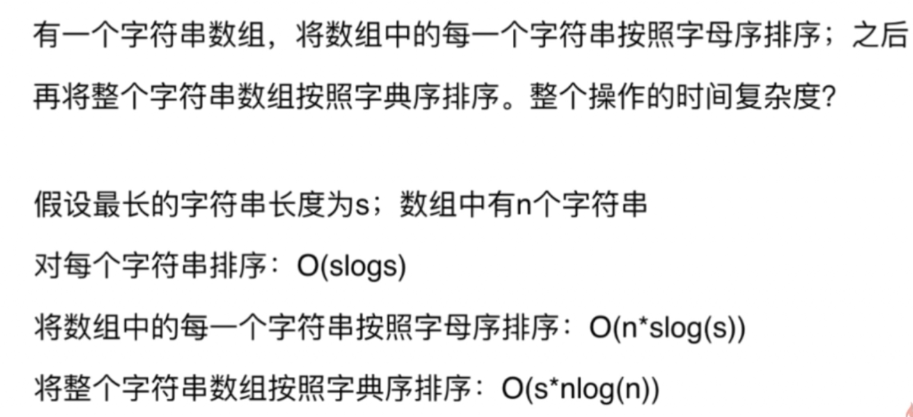
>注意：排序中 NlogN 是比较次数，对整形数组只进行 O(NlogN) 次比较，两个整数之间比较复杂度为 O(1)，两个字符串比较复杂度为O(s)

总时间复杂度为O(N * SlogS) + O(S * NlogN) = O(N * SlogS + S * NlogN) = O(N * S * (logS + logN))

#### 算法复杂度有些与用例相关
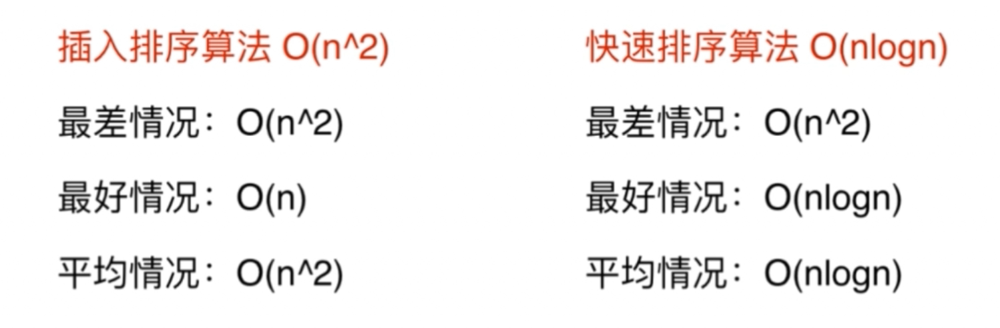

### 空间复杂度

多开一个辅助数组：O(N)
多开一个辅助二维数组：O(N*N)
多开常数空间：O(1)

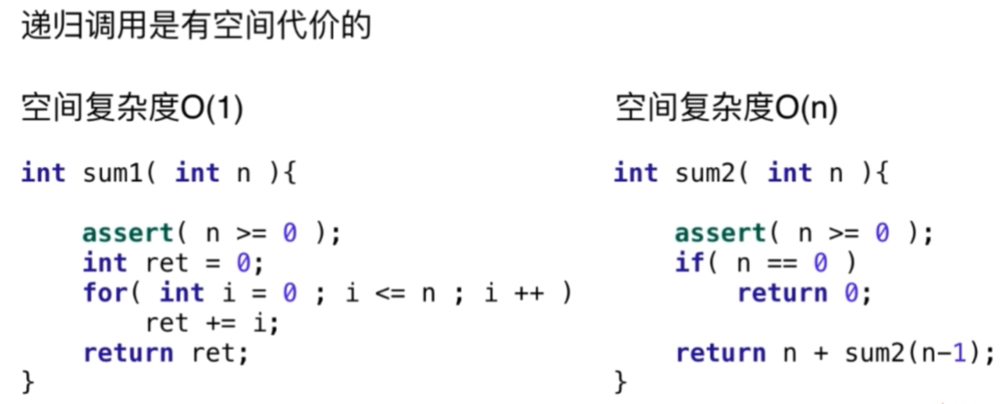

> 递归调用深度是多少，就要保存多少个状态，即空间复杂度就是多少

#### 常见复杂度

- O(logN)
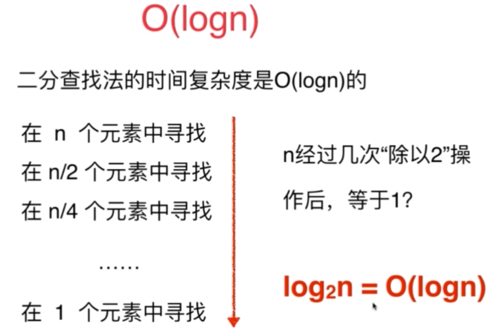
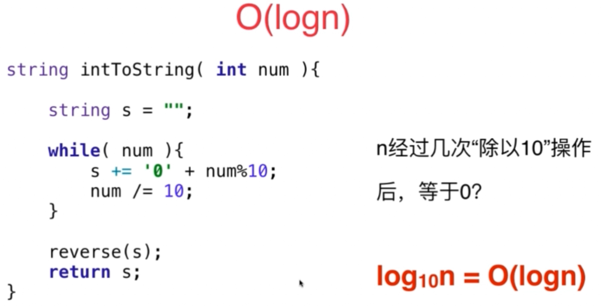

>注意：第一重循环执行 logN 次

- O(sqrt(N))
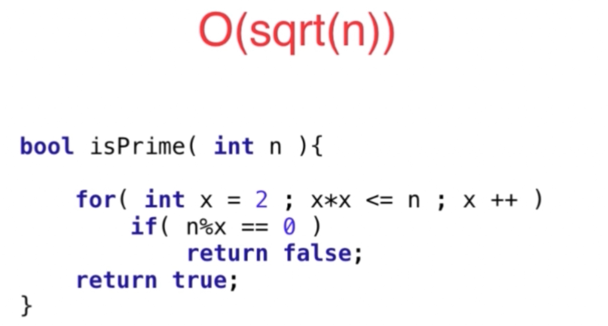

#### 递归时间复杂度

##### 递归中进行一次递归调用
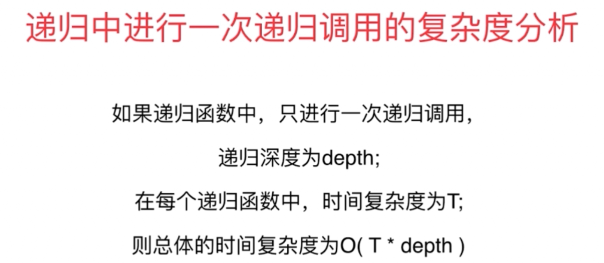

- pow()
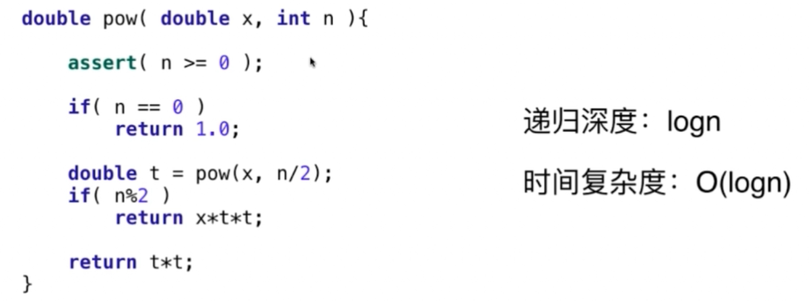

##### 递归中进行多次递归调用

- 看调用次数，通常可画递归树，多少节点就是多少次调用
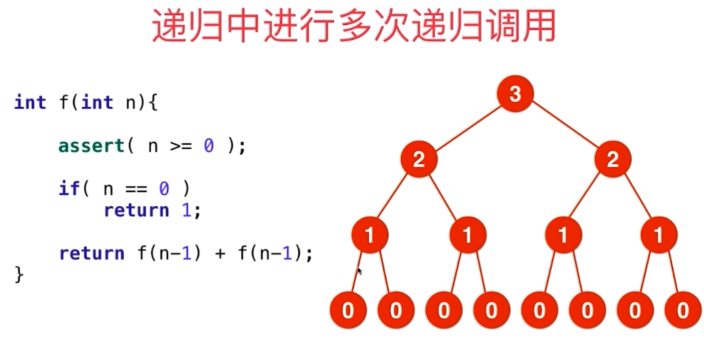
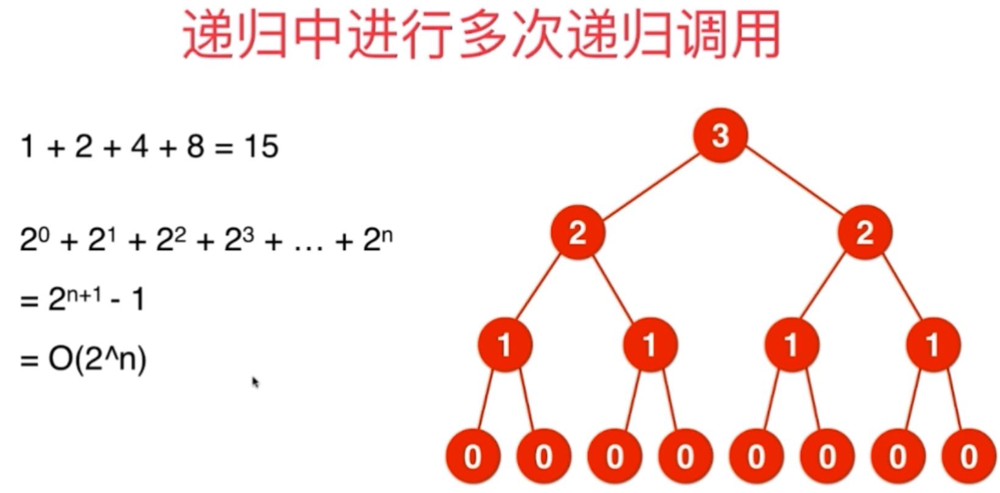

#### 均摊复杂度分析 Amortized Time

- 动态数组扩容
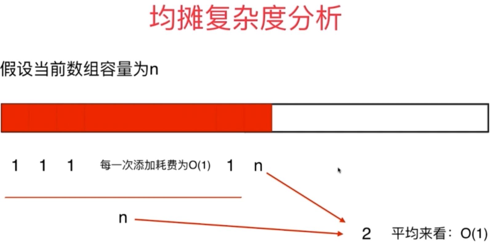

##### 防止复杂度震荡
- 在 n/2 处扩、缩容易震荡
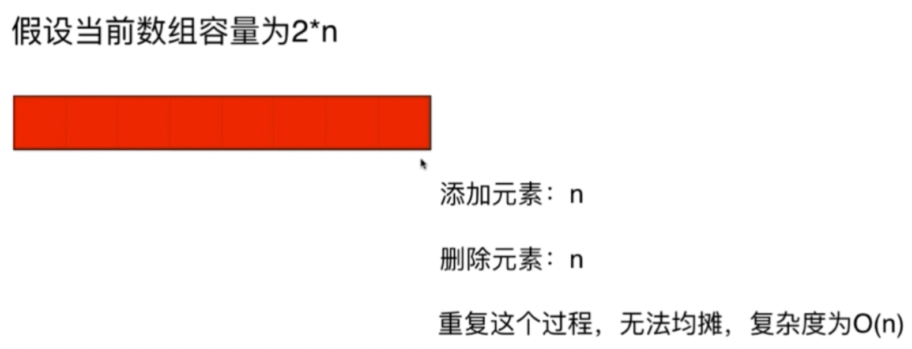
- 解决办法：在 n/4 处再缩容

- 动态数组、动态栈、动态队列

