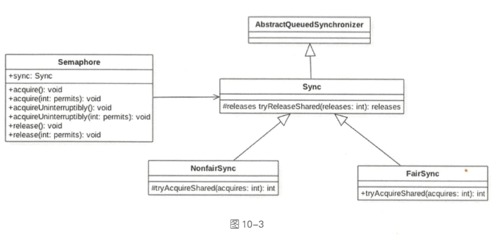

## Semaphore


Semaphore 类似于操作系统中的信号量，可以控制对互斥资源的访问线程数。

Semaphore 信号量也是 Java 中的一个同步器，与 CountDownLatch 和 CycleBarrier 不同的是，它内部的计数器是递增的，并且在一开始初始化 Semaphore 时可以指定一个初始值，但是并不需要知道需要同步的线程个数，而是在需要同步的地方调用 acquire 方法时指定需要同步的线程个数。

若构造 Semaphore 时传递的参数为 N，并在 M 个线程中调用了该信号量的 release 方法，那么在调用 acquire 使 M 个线程同步时传递的参数应该是 M + N



由该类图可知， Semaphore 还是使用 AQS 实现的。 Sync 只是对 AQS 的一个修饰，并且 Sync 有两个实现类，用来指定获取信号量时是否采用公平策略。例如，下面代码在创建 Semaphore 时会使用一个变量指定是否使用公平策略。

### 主要方法

#### 1. void acquire()方法

当前线程调用该方法的目的是希望获取一个信号量资源。 如果当前信号量个数大于 0, 则当前信号量的计数会减 1，然后该方法直接返回。否则如果当前信号量个数等于 0，则当前线程会被放入 AQS 的阻塞队列。当其他线程调用了当前线程的 interrupt() 方法中断了当前线程时，则当前线程会抛出 InterruptedException 异常返回。下面看下代码实现。

```java
public void acquire() throws InterruptedException {
    //传参为 1，说明要获取 1 个信号量资源
    sync.acquireSharedInterruptibly(1);
}

public final void acquireSharedInterruptibly(int arg)
            throws InterruptedException {
    //若线程被中断，则抛出中断异常
    if (Thread.interrupted())
        throw new InterruptedException();
    //否则调用 Sync 子类方法尝试获取，这里根据构造函数确定使用公平策略
    if (tryAcquireShared(arg) < 0)
        //若获取失败则放入阻塞队列。然后再次尝试，若失败则调用 park 方法挂起当前线程
        doAcquireSharedInterruptibly(arg);
}
```

由如上代码可知， acquire() 在内部调用了 Sync 的 acquireSharedlnterruptibly 方法，后 者会对中断进行响应(如果当前线程被中断，则抛出中断异常) 。尝试获取信号量资源的 AQS 的方法 tryAcquireShared 是由 Sync 的子类实现的，所以这里分别从两方面来讨论 。先讨论非公平策略 NonfairSync 类的 tryAcquireShared 方法，代码如下。
```java
protected int tryAcquireShared(int acquires) {
    return nonfairTryAcquireShared(acquires);
}

final int nonfairTryAcquireShared(int acquires) {
    for (;;) {
        //获取当前信号量值
        int available = getState();
        //计算当前剩余值
        int remaining = available - acquires;
        //若当前剩余值小于 0 或者 CAS 设置成功则返回
        if (remaining < 0 ||
            compareAndSetState(available, remaining))
            return remaining;
    }
}
```

如上代码先获取当前信号量值(available)，然后减去需要获取的值( acquires)，得到剩余的信号量个数(remaining)，如果剩余值小于 0 则说明当前信号量个数满足不了需求，那么直接返回负数，这时当前线程会被放入 AQS 的阻塞队列而被挂起 。 如果剩余值大于 0, 则使用 CAS 操作设置当前信号量值为剩余值，然后返回剩余值。
另外，由于 NonFairSync 是非公平获取的，也就是说先调用 aquire 方法获取信号量的线程不一定比后来者先获取到信号量。考虑下面场景，如果线程 A 先调用了 aquire() 方法获取信号量，但是当前信号量个数为 0， 那么线程 A 会被放入 AQS 的阻塞队列 。 过一段时间后线程 C 调用了 release() 方法释放了一个信号量，如果当前没有其他线程获取信号量，那么线程 A 就会被激活，然后获取该信号量，但是假如线程 C 释放信号量后，线程 C 调用了 aquire 方法，那么线程 C 就会和线程 A 去竞争这个信号量资源。如果采用非公平策略，由 nonfairTryAcquireShared 的代码可知，线程 C 完全可以在线程 A 被激活前， 或者激活后先于线程 A 获取到该信号量，也就是在这种模式下阻塞线程和当前请求的线程是竞争关系，而不遵循先来先得的策略。下面看公平性的 FairSync 类是如何保证公平性的。

```java
protected int tryAcquireShared(int acquires) {
    for (;;) {
        if (hasQueuedPredecessors())
            return -1;
        int available = getState();
        int remaining = available - acquires;
        if (remaining < 0 ||
            compareAndSetState(available, remaining))
            return remaining;
    }
}
```

可见公平性还是靠 hasQueuedPredecessors 这个函数来保证的。公平策略是看当前线程节点的前驱节点是否也在等待获取该资源，如果是则自己放弃获取的权限，然后当前线程会被放入 AQS 阻塞队列，否则就去获取。

#### 2. void acquire(int permits)方法

该方法与 acquire() 方法不同，后者只需要获取一个信号量值，而前者则获取 permits 个。

```java
public void acquire(int permits) throws InterruptedException {
    if (permits < 0) throw new IllegalArgumentException();
    sync.acquireSharedInterruptibly(permits);
}
```

#### 3. void acquireUninterruptibly() 方法

该方法与 acquire() 类似，不同之处在于该方法对中断不响应，也就是当当前线程调用了 acquireUninterruptibly 获取资源时(包含被阻塞后)，其他线程调用了当前线程的 interrupt() 方法设置了当前线程的中断标志，此时当前线程并不会抛出 InterruptedException 异常而返回。

```java
public void acquireUninterruptibly() {
    sync.acquireShared(1);
}
```

#### 4. acquireUninterruptibly(int permits) 方法

该方法与 acquire(int permits) 方法的不同之处在于，该方法对中断不响应。
```java
public void acquireUninterruptibly(int permits) {
    if (permits < 0) throw new IllegalArgumentException();
    sync.acquireShared(permits);
}
```

#### 5. void release() 方法

该方法的作用是把当前 Semaphore 对象的信号量值增加 1，如果当前有线程因为调用 aquire 方法被阻塞而被放入了 AQS 的阻塞队列，则会根据公平策略选择一个信号量个数能被满足的线程进行激活，激活的线程会尝试获取刚增加的信号量，fair 决定了正在等待的线程该由谁获取许可，如果是公平竞争则等待时间最长的线程获取，如果是非公平竞争则随机选择一个线程获取许可。下面看代码实现。

```java
public void release() {
    sync.releaseShared(1);
}

public final boolean releaseShared(int arg) {
    //尝试释放资源
    if (tryReleaseShared(arg)) {
        //资源释放成功则调用 park 方法唤醒 AQS 队列里面最先挂起的线程
        doReleaseShared();
        return true;
    }
    return false;
}

protected final boolean tryReleaseShared(int releases) {
    for (;;) {
        //获取当前信号量值
        int current = getState();
        //将当前信号量值增加 releases，这里为增加 1
        int next = current + releases;
        //溢出处理
        if (next < current) // overflow
            throw new Error("Maximum permit count exceeded");
        //使用 CAS 保证更新信号量值的原子性
        if (compareAndSetState(current, next))
            return true;
    }
}
```

由代码 release()->sync.releaseShared(1) 可知， release 方法每次只会对信号量值增加 1, tryReleaseShared 方法是无限循环，使用 CAS 保证了 release 方法对信号量递增 1 的原子性操作。 tryReleaseShared 方法增加信号量值成功后会执行代码 (3)，即调用 AQS 的方法来激活因为调用 aquire 方法而被阻塞的线程。

#### 6. void release(int permits) 方法

该方法与不带参数的 release 方法的不同之处在于，前者每次调用会在信号量值原来的基础上增加 permits，而后者每次增加 1。

```java
public void release(int permits) {
    if (permits < 0) throw new IllegalArgumentException();
    sync.releaseShared(permits);
}
```

另外可以看到，这里的 sync.releaseShared 是共享方法，这说明该信号量是线程共享的，信号量没有和固定线程绑定，多个线程可以同时使用 CAS 去更新信号量的值而不会被阻塞。

### 小结

本节首先通过案例介绍了 Semaphore 的使用方法， Semaphore 完全可以达到 CountDownLatch 的效果，但是 Semaphore 的计数器是不可以自动重置的 ， 不过通过变相地改变 aquire 方法的参数还是可以实现 CycleBanier 的功能的。然后介绍了 Semaphore 的源码实现，Semaphore 也是使用 AQS实现的，并且获取信号量时有公平策略和非公平策略之分。