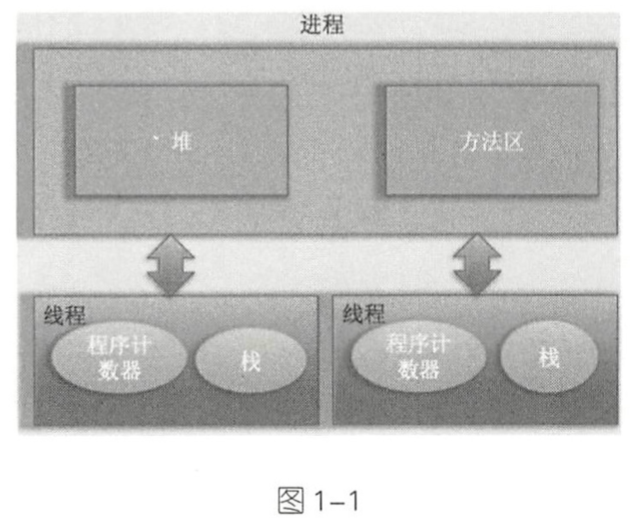
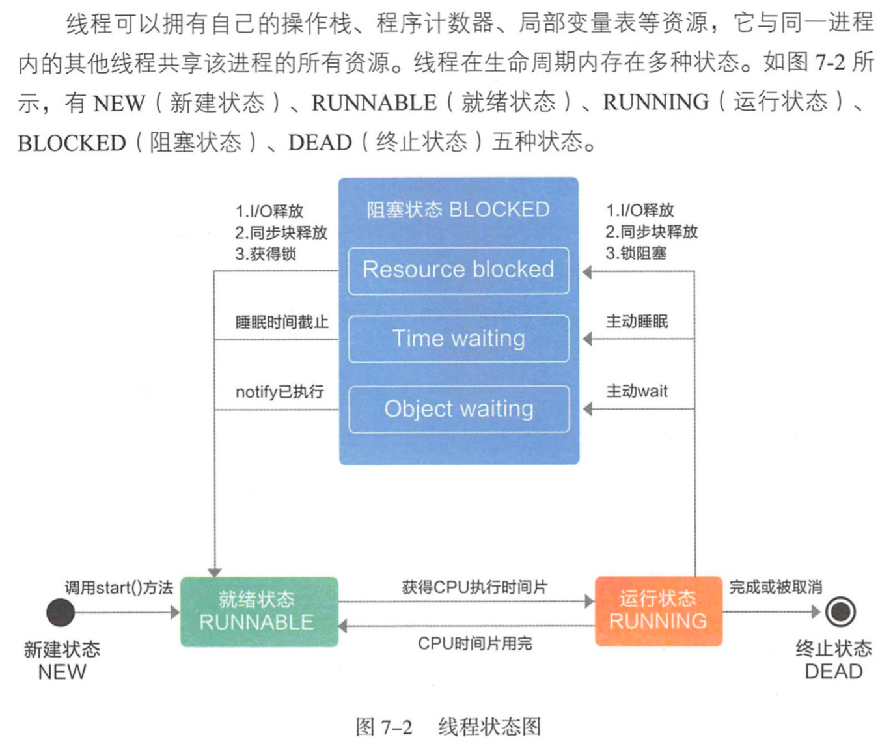
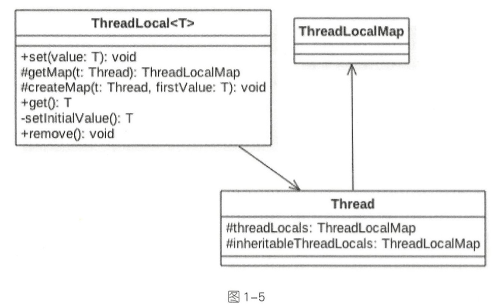
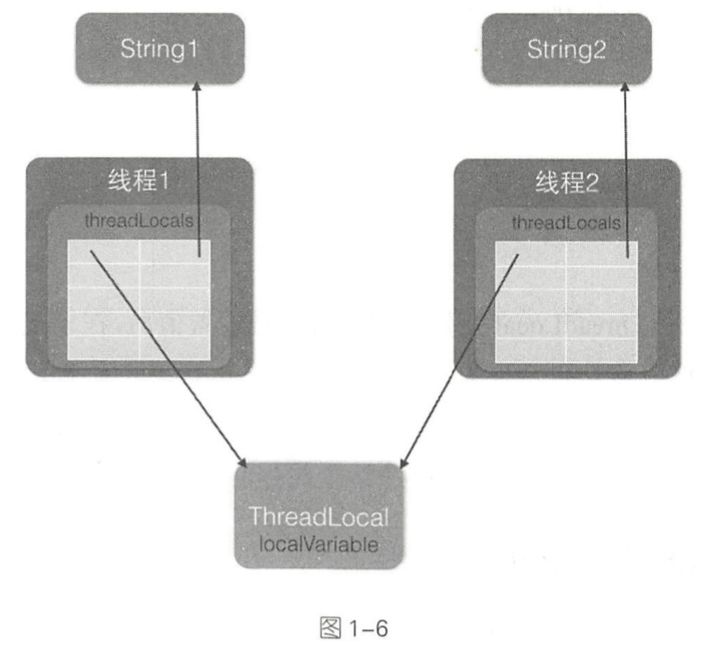

## 线程基础

### 什么是线程

进程：因为**线程是进程中的一个实体**，线程本身是不会独立存在的。进程是代码在数据集合上的一次运行活动，是系统进行资源分配和调度的基本单位，线程则是进程的一个**执行路径**， 一个进程中至少有一个线程，进程中 的多个线程共享进程的资源。

操作系统在分配资源时是把资源分配给进程的，但是 CPU 资源比较特殊，它是被分配到线程的，因为真正要占用 CPU 运行的是线程，所以也说线程是 CPU 分配的基本单位。

在Java中，当我们启动 main 函数时其实就启动了一个 JVM 的进程，而 main 函数所在的线程就是这个进程中的一个线程，也称主线程。



如图 1-1 可看到，一个进程中有多个线程，多个线程共享进程的堆和方法区资源，但每个线程有自己的程序计数器和栈区域。

程序计数器是一块内存区域，用来记录线程当前要执行的指令地址。那么为何要将程序计数器设计为线程私有的呢？前面说了线程是占用 CPU 执行的基本单位，而 CPU 一般是使用**时间片轮转**方式让线程轮询占用的，所以当前线程 CPU 时间片用完后，要让出 CPU，等下次轮到自己的时候再执行。那么如何知道之前程序执行到哪里了呢？其实程序计数器就是为了记录该线程让出 CPU 时的执行地址的，待再次分配到时间片时线程就可以从自己私有的计数器指定地址继续执行。另外需要注意的是，**如果执行的是 native 方法， 那么 pc 计数器记录的是 undefined 地址，只有执行的是 Java代码时 pc 计数器记录的才是下一条指令的地址 。

另外每个线程都有自己的战资源，用于存储该线程的局部变量，这些局部变量是该线程私有的，其他线程是访问不了的，除此之外栈还用来存放线程的调用栈帧。

堆是一个进程中最大的一块内存，堆是被进程中的所有线程共享的，是进程创建时分配的，堆里面主要存放使用 new 操作创建的对象实例。

方法区则用来存放 JVM 加载的类、常量及静态变量等信息，也是线程共享的。

### 线程创建与运行

Java 中有三种线程创建方式，分别为实现 Runnable 接口的 run 方法，继承 Thread 类并重写 run 的方法，使用 方式。

```java
public class ThreadTest {
    //继承 Thread 类并重写 run 方法
    public static class MyThread extends Thread {
        @Override
        public void run() {
            System.out.println("I am a child thread");
        }
    }

    public static class RunnableTask implements Runnable {
        @Override
        public void run() {
            System.out.println("I am a child thread");
        }
    }

    public static class CallerTask implements Callable<String> {
        @Override
        public String call() {
            return "hello";
        }
    }

    public static void main(String[] args) {
        MyThread thread = new MyThread();
        thread.start();

        RunnableTask task = new RunnableTask();
        new Thread(task).start();
        new Thread(task).start();

        FutureTask<String> futureTask = new FutureTask<>(new CallerTask());
        new Thread(futureTask).start();
        try {
            String res = futureTask.get();
            System.out.println(res);
        } catch (Exception e) {
            e.printStackTrace();
        }
    }
}
```

需要注意的是，当创建完 thread 对象后该线程并没有被启动执行，**调用 start 方法后线程并没有马上执行而是处于就绪状态，这个就绪状态是指该线程已经获取了除 CPU 资源外的其他资源**，等待获取 CPU 资源后才会真正处于运行状态。一旦 run 方法执行完毕，该线程就处于终止状态。



#### 小结
继承方式的优点：
- 在 run() 方法内获取当前线程直接使用 this 就可以了，无须使用 Thread.currentThread() 方法
- 方便传参。可以在子类里面添加成员变量，通过 set 方法设置参数或者通过构造函数进行传递。而如果**使用 Runnable 方式，则只能使用主线程里面被声明为 final 的变量**。

缺点：
- Java 不支持多继承。如果继承了 Thread 类，那么就不能再继承其他类。
- 任务与代码没有分离。当多个线程执行一样的任务时需要多份任务代码，而 Runable 则没有这个限制。

### 线程通知与等待

#### 1. wait() 函数

当一个线程调用一个共享变量的 wait() 方法时，该调用线程会被阻塞挂起，直到发生下面几件事情之一才返回:
1. 其他线程调用了该共享对象的 notify() 或者 notifyAll() 方法
1. 其他线程调用了该线程的 interrupt()方法， 该线程抛出 InterruptedException 异常返回。

另外需要注意的是，如果调用 wait() 方法的线程没有事先获取该对象的监视器锁，则调用 wait() 方法时调用线程会抛出 IllegalMonitorStateException 异常。那么一个线程如何才能获取一个共享变量的监视器锁呢？
1. 执行 synchronized 同步代码块时，使用该共享变量作为参数。
    ```java
    synchronized(共享变量) {
        //doSomething
    }
    ```
1. 调用该共享变量的方法，并且该方法使用了 synchronized 修饰。
    ```java
    synchronized void add (int a, int b) {
        //doSomething
    }
    ```

另外需要注意的是，一个线程可以在没有被其他线程调用 notify()、notifyAll() 方法进行通知情况下，从挂起状态变为可以运行状态(也就是被唤醒)：
- 或者被中断
- 或者等待超时

这就是所谓的**虚假唤醒**。

虽然虚假唤醒在应用实践中很少发生，但要防患于未然，做法就是**不停地去测试该线 程被唤醒的条件是否满足，不满足则继续等待**，即在一个循环中调用 wait() 方法进 行防范。退出循环的条件是满足了唤醒该线程的条件。

```java
synchronized(obj) {
    while(条件不满足){
        obj.wait();
    }
}
```

生产者消费者举例：

```java
//生产者线程
synchronized (queue) {
    //消费队列满，贝等待队列空闲
    while (queue.size() == MAX_SIZE) {
        try {
            //挂起当前线程，并释放通过同步块获取的 queue 上的锁，让消费者线程可以获取该锁，然后获取队列里面的元素
            queue.wait();
        } catch (InterruptedException e) {
            e.printStackTrace();
        }
    }
    //空闲则生成元素，并通知消费者线程
    queue.add(ele);
    queue.notifyAll();
}

//消费者线程
synchronized (queue) {
    //消费队列为空
    while (queue.size() == 0) {
        try {
            //挂起当前线程，并释放通过同步块获取的 queue 上的锁，让生产者线程可以获取该锁，将生产元素放入队列
            queue.wait();
        } catch (InterruptedException e) {
            e.printStackTrace();
        }
    }
    //消费元素，并通知唤醒生产者线程
    queue.take();
    queue.notifyAll();
}
```

在如上代码中假如生产者线程 A 首先通过 synchronized 获取到了 queue 上的锁，那么后续所有企图生产元素的线程和消费线程将会在获取该监视器锁的地方被阻塞挂起。线程 A 获取锁后发现当前队列己满会调用 queue.wait() 方法阻塞自己，然后释放获取的 queue 上的锁，这里考虑下为何要释放该锁？如果不释放，由于其他生产者线程和所有消费者线程都己经被阻塞挂起，而线程 A 也被挂起，这就处于了死锁状态。这里线程 A 挂起自己后释放共享变量上的锁，就是为了打破死锁必要条件之一的持有并等待原则。关于死锁后面的章节会讲。线程 A 释放锁后，其他生产者线程和所有消费者线程中会有一个线程获取 queue 上的锁进而进入同步块，这就打破了死锁状态。

另外需要注意的是，当前线程调用共享变量的 wait() 方法后只会释放当前共享变量上 的锁，如果当前线程还持有其他共享变量的锁，则这些锁是不会被释放的。下面来看一个例子。

```java
private static volatile Object resA = new Object();
private static volatile Object resB = new Object();

public static void main(String[] args) throws InterruptedException {
    Thread threadA = new Thread(new Runnable() {
        @Override
        public void run() {
            try {
                synchronized (resA) {
                    System.out.println("threadA get resA lock");
                    synchronized (resB) {
                        System.out.println("threadA get resB lock");
                        //线程A阻塞，并择放获取到的 resA 的锁
                        System.out.println("threadA release resA lock");
                        resA.wait();
                    }
                }
            } catch (Exception e) {
                e.printStackTrace();
            }
        }
    });

    Thread threadB = new Thread(new Runnable() {
        @Override
        public void run() {
            try {
                Thread.sleep(1000);
                //获取 resA 共享资源的监视器锁
                synchronized (resA) {
                    System.out.println("threadB get resA lock");

                    System.out.println("threadB try get resB lock...");
                    //获取 resB 共享资源的监视器锁
                    synchronized (resB) {
                        System.out.println("threadB get resB lock");
                        //线程B阻塞，并择放获取到的 resourceA的锁
                        System.out.println("threadA release resA lock");
                        resA.wait();

                    }
                }
            } catch (Exception e) {
                e.printStackTrace();
            }
        }
    });
    threadA.start();
    threadB.start();

    threadA.join();
    threadB.join();
}
```

#### 2. wait(long timeout) 函数

该方法相比 wait() 方法多了一个超时参数，它的不同之处在于，如果一个线程调用共享对象的该方法挂起后，没有在指定的 timeout ms 时间内被其他线程调用该共享变量的 notify() 或者 notifyAll() 方法唤醒，那么该函数还是会因为超时而返回。如果将 timeout 设置为 0 则和 wait 方法效果一样，因为在 wait 方法内部就是调用了 wait(O)。需要注意的是，如果在调用该函数时，传递了一个负的 timeout 则会抛出 IllegalArgumentException 异常。

#### 3. wait(long timeout, int nanos) 函数

```java
public final void wait(long timeout, int nanos) throws InterruptedException {
    if (timeout < 0) {
        throw new IllegalArgumentException("timeout value is negative");
    }
    if (nanos < 0 || nanos > 999999) {
        throw new IllegalArgumentException(
                            "nanosecond timeout value out of range");
    }
    if (nanos > 0) {
        timeout++;
    }
    wait(timeout);
}
```

#### 4 . notify() 函数

一个线程调用共享对象的 notify() 方法后，会唤醒一个在该共享变量上调用 wait 系列方法后被挂起的线程。一个共享变量上可能会有多个线程在等待，具体唤醒哪个等待的线程是随机的。

此外，**被唤醒的线程不能马上从 wait 方法返回并继续执行，它必须在获取了共享对
象的监视器锁后才可以返回也就是唤醒它的线程释放了共享变量上的监视器锁后，被唤醒的线程也不一定会获取到共享对象的监视器锁，这是因为该线程还需要和其他线程一起竞争该锁，只有该线程竞争到了共享变量的监视器锁后才可以继续执行。**
类似 wait 系列方法，只有当前线程获取到了共享变量的监视器锁后，才可以调用共 享变量的 notify() 方法，否则会抛出 IllegalMonitorStateException 异常。

#### 5. notifyAll() 函数

不同于在共享变量上调用 notify() 函数会唤醒被阻塞到该共享变量上的一个线程，
notifyAll() 方法则会唤醒所有在该共享变量上由于调用 wait 系列方法而被挂起的线程。

要注意的地方是，在共享变量上调用 notifyAll() 方法只会唤醒调用这个方法前调用了 wait 系列函数而被放入共享变量等待集合里面的线程。如果调用 notifyAll() 方法后一个线程调用了该共享变量的 wait() 方法而被放入阻塞集合，则该线程是不会被唤醒的。尝试把主线程里面休眠 1s 的代码注释掉，再运行程序会有一定概率输出下面的结果。

### 等待线程执行终止的 join 方法

线程 A 调用线程 B 的 join 方法后会被阻塞 ， 当其他线程调用了线程 A 的 interrupt() 方法中断了线程 A 时，线程 A 会抛出 InterruptedException 异常而返回。

### 让线程睡眠的 sleep 方法

Thread 类中有一个静态的 sleep 方法，当一个执行中的线程调用了 Thread 的 sleep 方法后，调用线程会暂时让出指定时间的执行权，也就是在这期间不参与 CPU 的调度，但是该线程所拥有的监视器资源，比如锁还是持有不让出的。 指定的睡眠时间到了后该函数会正常返回，线程就处于就绪状态，然后参与 CPU 的调度，获取到 CPU 资源后就可以继续运行了。如果在睡眠期间其他线程调用了该线程的 interrupt() 方法中断了该线程，则该线程会在调用 sleep 方法的地方抛出 InterruptedException 异常而返回 。

### 让出 CPU 执行权的 yield 方法

### 线程中断

- void interrupt() 方法: 中断线程
- boolean isInterrupted() 方法：检测当前线程是否被中断，如果是返回 true，否则返回 false
```java
public boolean isInterrupted() {
    //传false，说明不清除中断标志
    return isInterrupted(false);
}
```
- boolean interrupted() 方法：static 类方法，检测当前线程是否被中断，如果是返回 true，否则返回 false。
```java
public static boolean interrupted() {
    //清除中断标志
    return currentThread().isInterrupted(true);
}
```

```java
public class InterruptTest {
    public static void main(String[] args) throws InterruptedException {
        Thread threadOne = new Thread(new Runnable() {
            @Override
            public void run() {
                while (true) {
                }
            }
        });

        //启动线程
        threadOne.start();
        //设置中断标志
        threadOne.interrupt();
        //获取中断标志
        System.out.println("isInterrupted: " + threadOne.isInterrupted());
        //获取中断标志并重置
        System.out.println("isInterrupted: " + threadOne.interrupted());
        //获取中断标志并重置
        System.out.println("isInterrupted: " + Thread.interrupted());
        //获取中断标志
        System.out.println("isInterrupted: " + threadOne.isInterrupted());

        threadOne.join();
        System.out.println("main thread is over");
    }
}
/**
输出：true、false、false、true
*/
```

第一行输出 true 这个大家应该都可以想到， 但是下面三行为何是 false、false、true 呢，不应该是 true、 false、 false 吗？如果你有这个疑问，则说明你对这两个函数的区别还是不太清楚。上面我们介绍了在 interrupted() 方法内部是获取当前线程的中断状态，这里虽然调用了 threadOne 的 interrupted() 方法，但是获取的是主线程的中断标志，因为**主线程是当前线程**。threadOne.interrupted()和 Thread.interrupted() 方法的作用是一样的，目的都是获取当前线程的中断标志。

```java
Thread threadTwo = new Thread(new Runnable() {
    @Override
    public void run() {
        while (!Thread.currentThread().isInterrupted()){

        }
        System.out.println("threadTwo isInterrupted:" + Thread.currentThread().isInterrupted());
        System.out.println("threadTwo isInterrupted:" + Thread.interrupted());
        System.out.println("threadTwo isInterrupted:" + Thread.currentThread().isInterrupted());
        System.out.println("threadTwo isInterrupted:" + Thread.interrupted());
    }
});

threadTwo.start();
threadTwo.interrupt();

threadTwo.join();
System.out.println("main thread is over");
/**
输出：true、true、false、false
*/
```

### 理解线程上下文切换

#### 如何避免线程死锁

要想避免死锁，只需要破坏掉至少一个构造死锁的必要条件即可，但是学过操作系统应该都知道，目前只有请求并持有和环路等待条件是可以被破坏的。

造成死锁的原因其实和申请资源的顺序有很大关系，使用资源申请的有序性原则就可以避免死锁。

#### 守护线程和用户线程

main 线程运行结束后，JVM 会自动启动一个叫作 DestroyJavaVM 的线程，该线程会等待所有用户线程结束后终止 JVM 进程。

在 Tomcat 的 NIO 实现 NioEndpoint 中会开启一组接受线程来接受用户的连接请求，以及一组处理线程负责具体处理用户请求。在默认情况下，接受线程和处理线程都是守护线程，这意味着当 tomcat 收到 shutdown 命令后并且没有其他用户线程存在的情况下 tomcat 进程会马上消亡，而不会等待处理线程处理完当前的请求。

#### ThreadLocal



Thread 类中有一个 threadLocals 和一个 inheritableThreadLocals，它们都 是 ThreadLocalMap 类型的变量 ， 而 ThreadLocalMap 是一个定制化的 Hashmap。在默认情况下，每个线程中的这两个变量都为 null，只有当前线程第一次调用 ThreadLocal 的 set 或者 get 方法时才会创建它们。其实每个线程的本地变量不是存放在 ThreadLocal 实例里面，而是存放在调用线程的 threadLocals 变量里面。Thread 里面的 threadLocals 为何被设计为 map 结构？很明显是因为每个线程可以关联多个 ThreadLocal 变量。



如图 1-6 所示，在每个线程内部都有一个名为 threadLocals 的成员变量，该变量的类型为 HashMap，其中 key 为我们定义的 ThreadLocal 变量的 this 引用，value 则为我们使用 set 方法设置的值。**每个线程的本地变量存放在线程自己的内存变量 threadLocals 中，如果当前线程一直不消亡，那么这些本地变量会一直存在，所以可能会造成内存溢出，因此使用完毕后要记得调用 ThreadLocal 的 remove 方法删除对应线程的 threadLocals 中的本地变量。**在 JUC 包里面的 ThreadLocalRandom 就是借鉴 ThreadLocal 思想实现的。

#### ThreadLocal 不支持继承性
InheritableThreadLocal 继承自 ThreadLocal，其提供了一个特性，就是让子线程可以访问在父线程中设置的本地变量。

应用场景：

- 子线程需要使用存放在 threadlocal 变量中的用户登录信息
- 一些中间件需要把统一的 id 追踪的整个调用链路记录下来