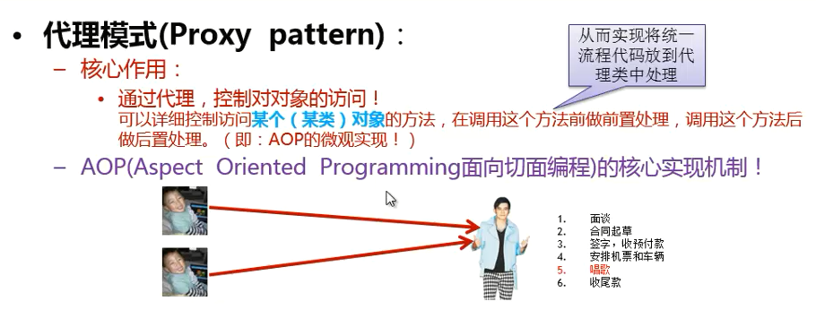
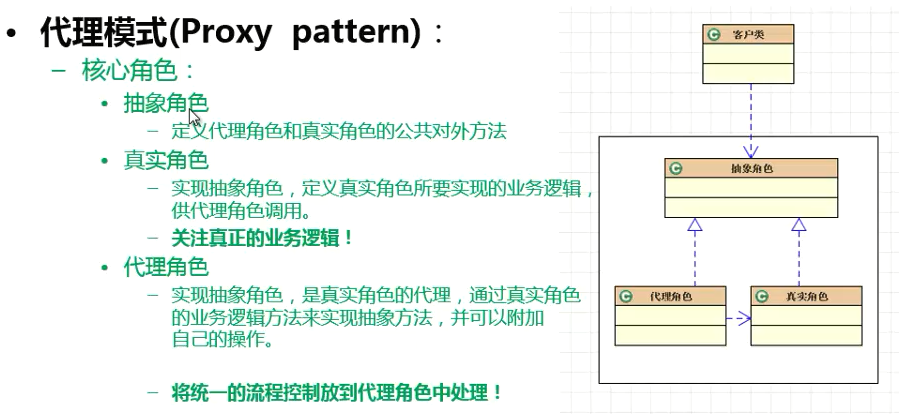
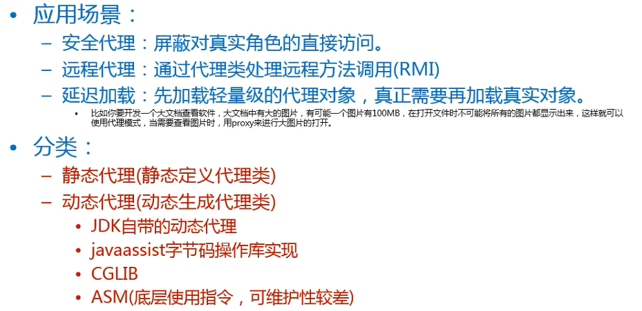
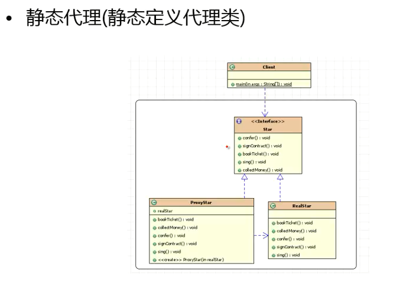
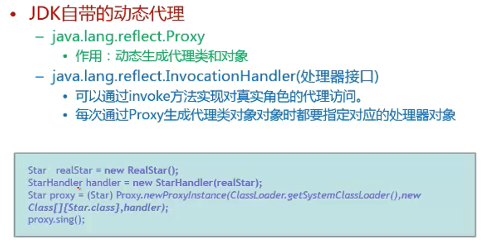

### 代理模式

#### 代理模式详解

 

#### 应用场景和分类

#### 静态代理

- 静态定义代理类案例

#### 动态代理

- 动态生成代理类
    - JDK 自带的动态代理
    - javaassist 字节码操作库实现
    - CGLIB
    - ASM(底层使用指令，可维护性较差)
- 动态代理优点
    - 抽象角色中（接口）声明的所有方法都被转移到调用处理器一个集中的方法中处理，这样可以更加灵活和统一处理众多方法

