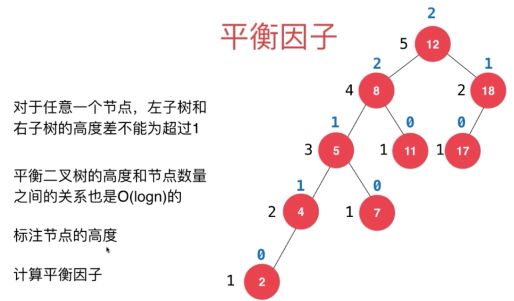
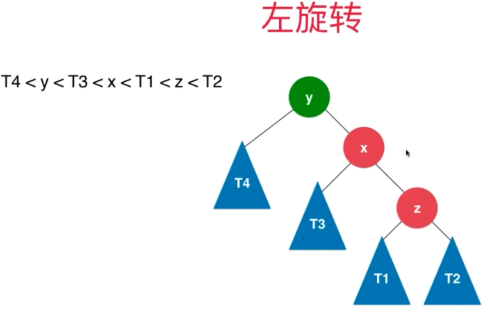
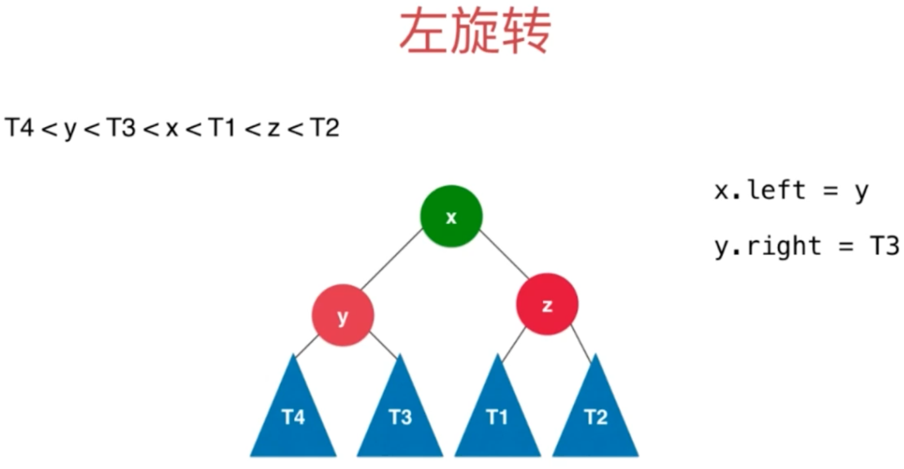
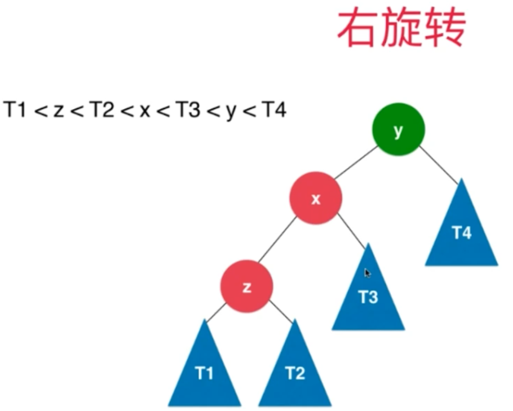
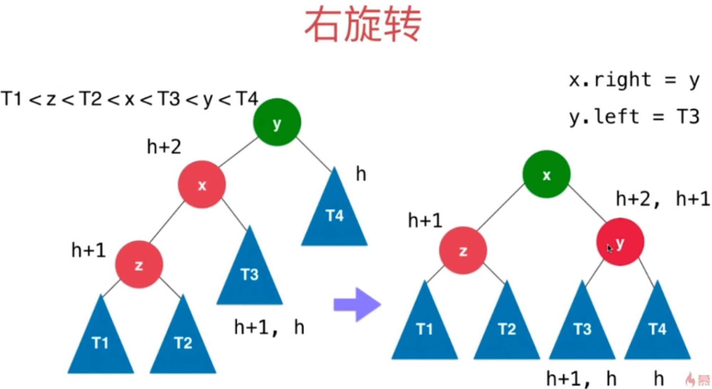
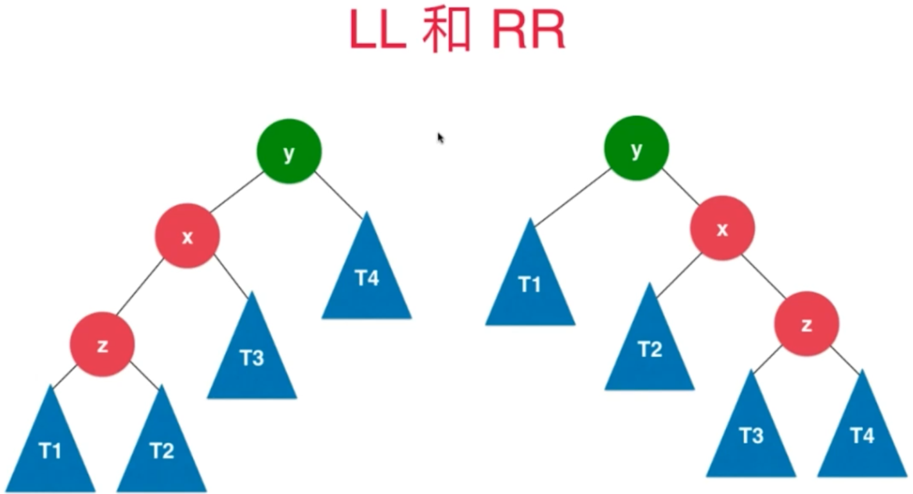
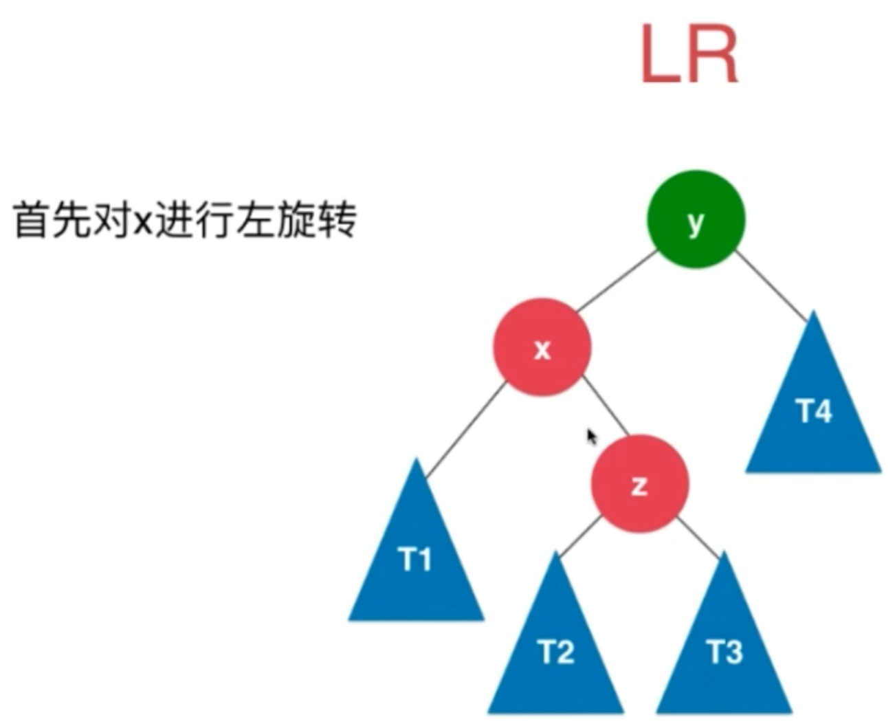
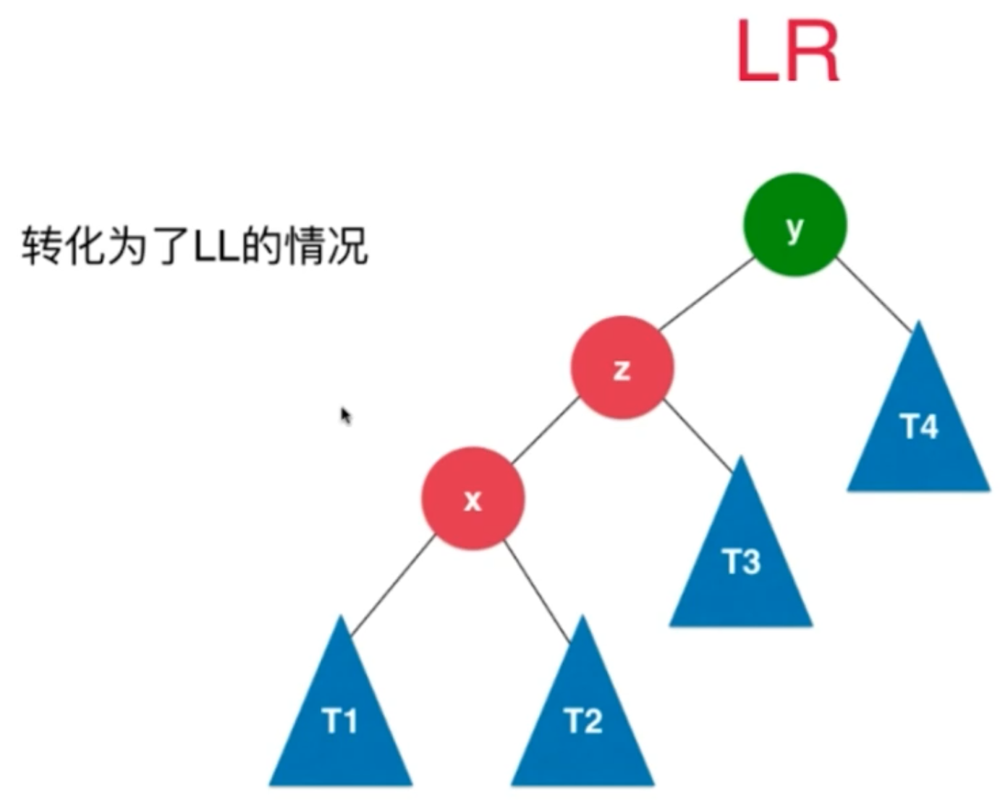
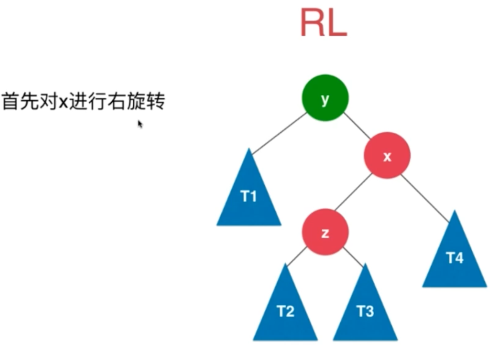
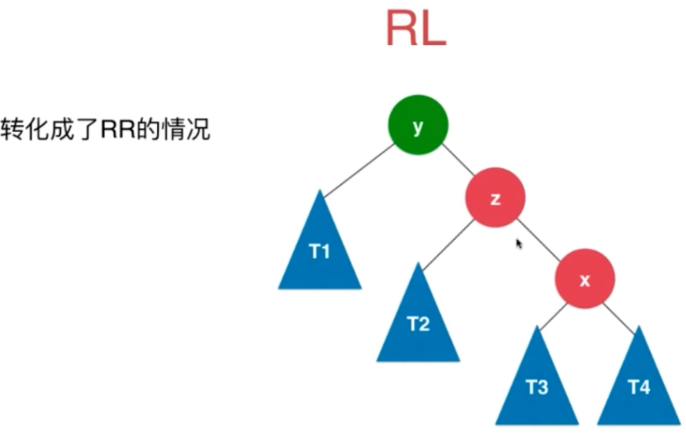

### 平衡二叉树
- 对于任意一个节点，其左、右子树高度不超过1。高度和节点数量关系是O(logN)
- 平衡因子：左右子树高度差（左子树高度-右子树高度），根据平衡因子判断是否平衡
    

### 平衡维护

#### LL -> 左旋转

- 旋转前：

- 旋转后：

#### RR -> 右旋转

- 旋转前：

- 旋转后：

#### LL/RR/LR/RL

- LR -> LL

- RL -> RR

