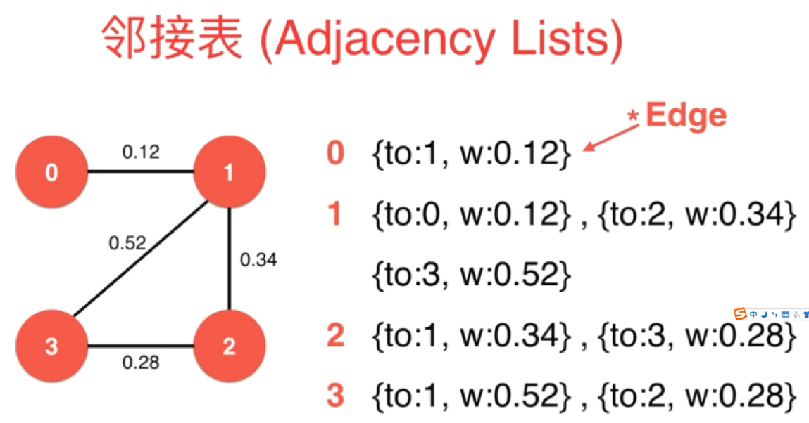
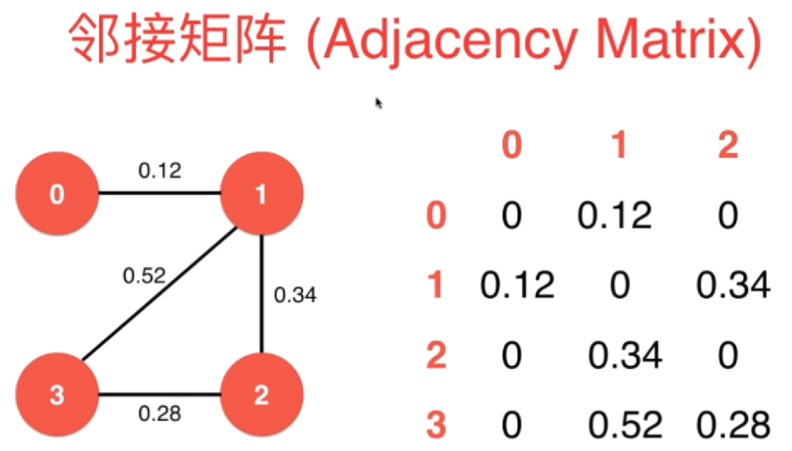
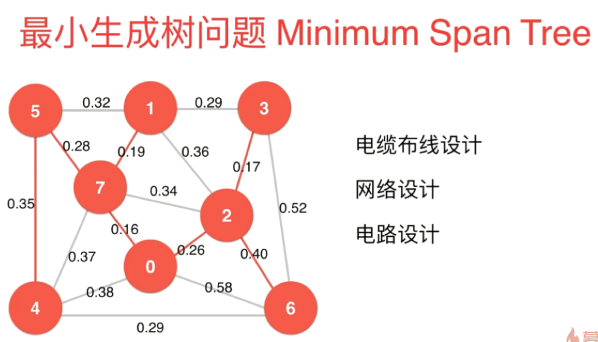
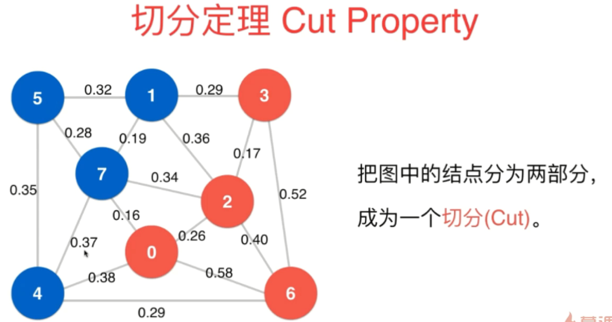
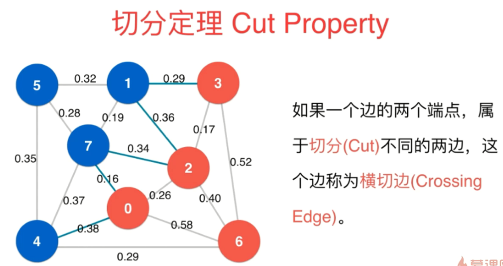
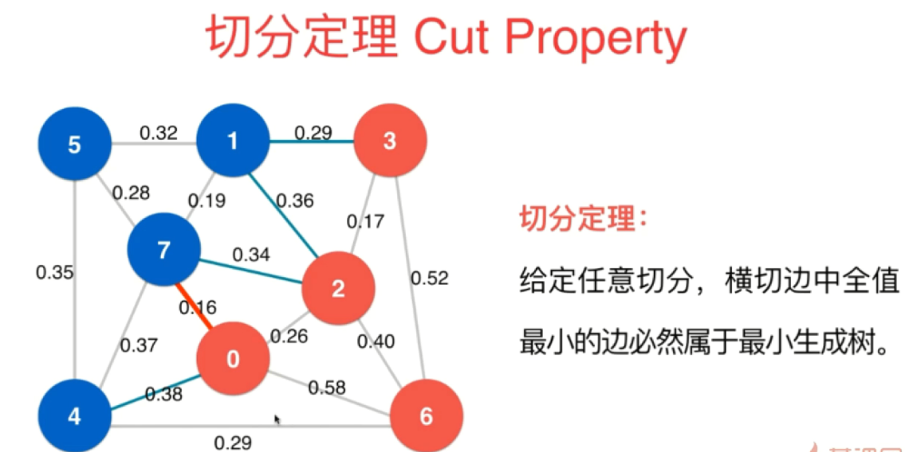
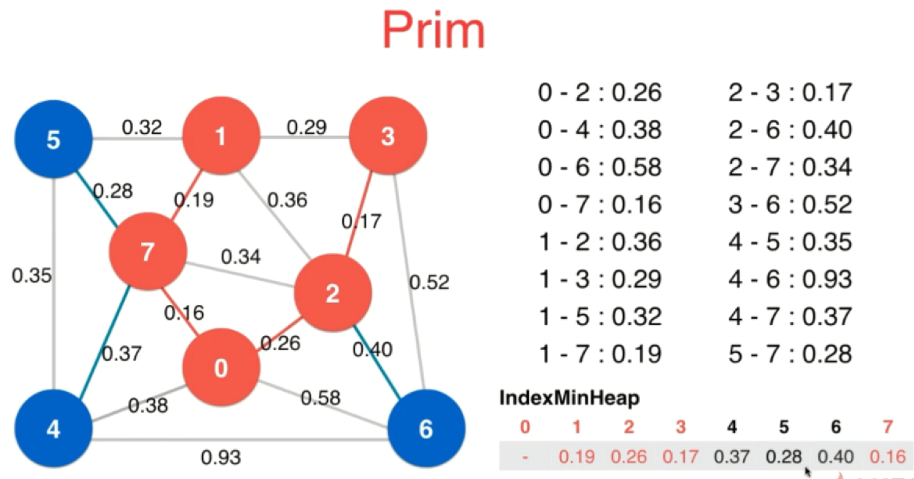

### 最小生成树

#### 带权图

- 带权图邻接表

- 带权图邻接矩阵

#### 最小生成树
找 V-1 条边，连接 V 个顶点，总权值最小

> 通常针对 带权无向图、连通图

#### 切分定理

### Lazy Prim 算法
#### Lazy Prim 算法流程

将 0 作为起始点，开始切分，逐步将蓝色阵营的顶点，转换到红色阵营中
1. 将 0 加入到红色阵营中
这样一来，就形成了一个切分，相应的就有横切边，接下来将**最小堆**作为辅助数据结构，可以非常快速地找到，横切边中权值最小的那条边，将横切边放入到最小堆中，并拿出最小堆中权值最小的边。此时，0-7 是权值最小的边，权值为 0.16，且 0、7 分属不同阵营，一定属于最小生成树
1. 将 7 加入到红色阵营中...
1. 将 1 加入到红色阵营中...
1. 将 2 加入到红色阵营中...
1. ......

至此，**所有蓝色阵营的顶点都已经转换到红色阵营中**，此时，Lazy Prim 算法其实就已经可以结束了。但如果是以最小堆中的边为空作为结束依据的话，依然可以从最小堆中继续拿出权值最小的边，不过，这之后拿出的边肯定不再是横切边了。

> 注意：此时，1-2 和 2-7 实际上已经不是横切边了，本来应该从最小堆中剔除，不能再作为最小生成树的候选边，但这里并不急着剔除，而是依然保留在最小堆中，当二者上移到最小堆的顶端被拿出来时，就会发现二者的两端同属红色阵营，直接把二者扔掉即可，这也正是Lazy Prim算法的懒之所在。

#### Lazy Prim 时间复杂度
Lazy Prim 时间复杂度：O(ElogE)

### Prim 算法

#### Prim 流程

Prim 算法是 Lazy Prim 算法的优化，Lazy Prim 的主要问题：

1. 图中所有的边都要进入最小堆，虽然随着切分的改变，红色阵营中的顶点越来越多，但很多已经在最小堆中的边，其实已经不再是横切边了
1. 虽然横切边有很多，但通常只关注权值最小的横切边，尤其是和每个顶点相连的横切边中权值最小的那条边

基于此，Prim 算法的实现如下：

**将最小索引堆作为辅助数据结构，用来存储和每个顶点相连的横切边中权值最小的那条边，随着切分改变，只要不断更新和每个顶点相连的横切边中权值最小的那条边即可**

#### Prim 时间复杂度
Prim 时间复杂度：O(ElogV)

### Kruskal 算法
在 Prim 算法中，不停地改变切分，同时通过切分寻找横切边中权值最小的那条边。在这个过程中，可能有人就会有这样一个想法：如果每次都找当前权值最小的那条边（不是横切边中），那么
它就一定属于最小生成树。

0-7 是权值最小的边，权值为 0.16，就可以说 0-7 一定属于最小生成树。这是因为：总能找到一个切分，使得对于这个切分而言，1-7 就是横切边中的权值最小的那条边。采用这样的思路不断去找当前权值最小的边，**只要这些权值最小的边不构成环**，那么这些依次取得的边就一定属于最小生成树，这就是 Kruskal 算法的思想。
> 使用 Union Find 快速判断环

#### Kruskal 算法时间复杂度
Kruskal 算法时间复杂度：O(ElogE)

### 总结
- 复杂度
    - Lazy Prim：O(ElogE)
    - Prim：O(ElogV)
    - Kruskal：O(ElogE)
- 如果有相等的横切边：根据算法具体实现，每次选择一个边，此时图存在多个最小生成树MST
- Vyssotsky's algorithm：将边逐渐添加到生成树中，一旦形成环，删除环中权值最大的边（复杂，不易实现）

