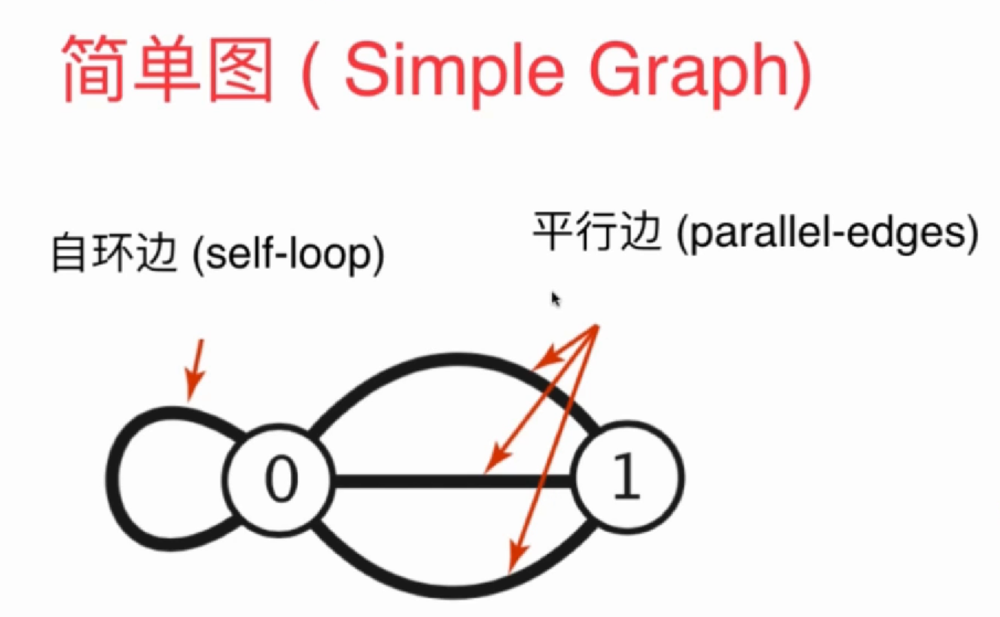
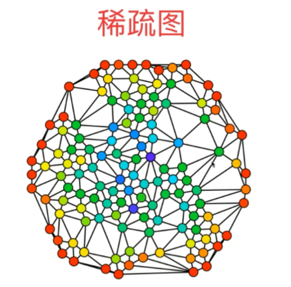
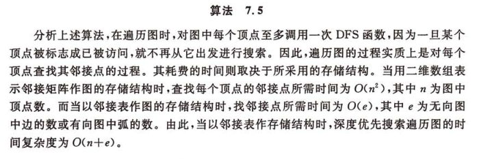

### 图

#### 分类
- 边有无方向
    - 无向图
    - 有向图
- 边有无权值
    - 无权图
    - 有权图

#### 简单图

没有**自环边**和**平行边**的图

#### 图的表示

> 实质是对于边的表示

1. 邻接矩阵 Adjacency Matrix：适合表示稠密图（边多）
1. 邻 接 表 Adjacency Table：适合表示稀疏图（边少）
> 什么算边多边少？如果每个点和其余点几乎都有边，则稠密；反之，稀疏；
> 完全图：两两节点之间都有边

#### 图的遍历

- 邻接矩阵：O(V*V)
- 邻接表：O(E)

#### 深度优先遍历

##### 应用
- 求连通分量，判断两点是否同属同一连通分量
- 求两点之间路径

##### DFS时间复杂度
- 稀疏图（邻接表）：O(V+E) （通常边数多于顶点数，约为O(E)）
- 稠密图（邻接矩阵）：O(V*V)

> 深度优先遍历对有向图依然有效

#### 广度优先遍历

##### 应用
- 求无权图的最短路径（有向/无向图均可）

##### BFS时间复杂度
- 稀疏图（邻接表）：O(V+E)
- 稠密图（邻接矩阵）：O(V*V)

##### DFS 与 BFS 时间复杂度

- DFS 复杂度分析

- BFS 复杂度分析

- 参考：
    - [数据结构（C语言版）](https://book.douban.com/subject/24699581/)
    - [Why is the complexity of DFS O(V+E)?](https://www.quora.com/Why-is-the-complexity-of-DFS-O-V+E)
    - [Why is the complexity of BFS O(V+E) instead of O(V*E)?](https://stackoverflow.com/questions/18604803/why-is-the-complexity-of-bfs-ove-instead-of-ove)