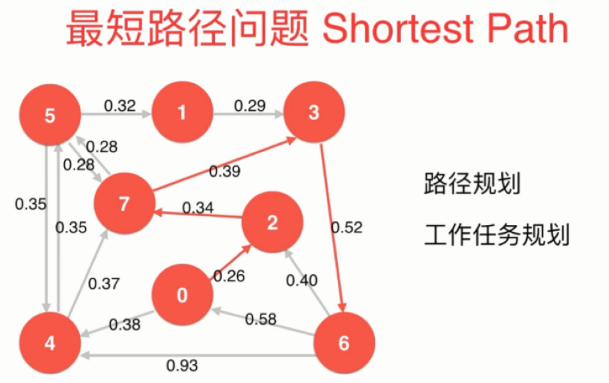
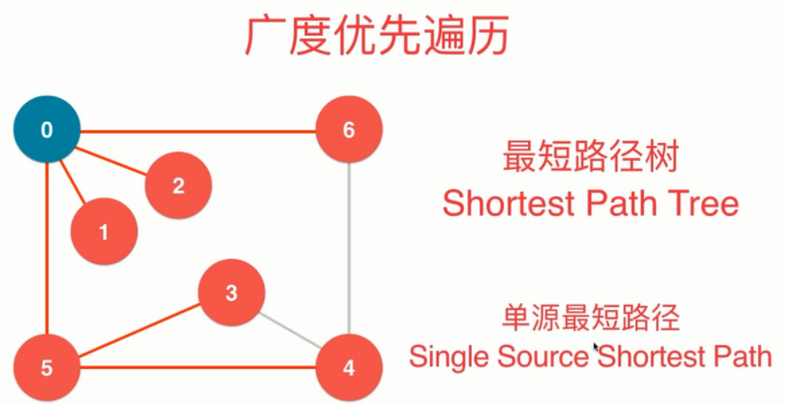
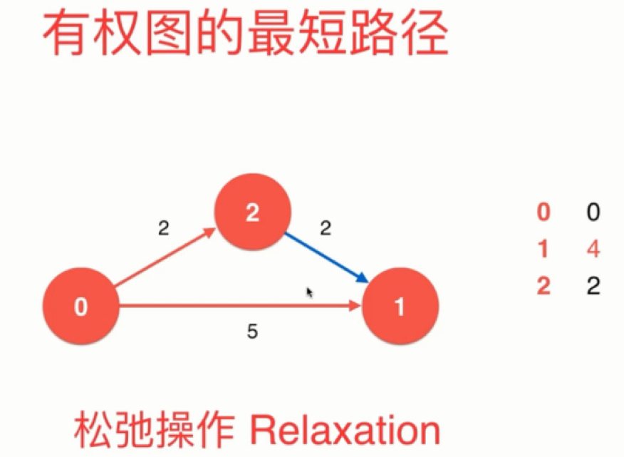
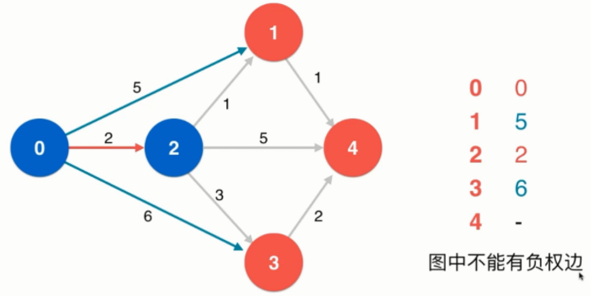
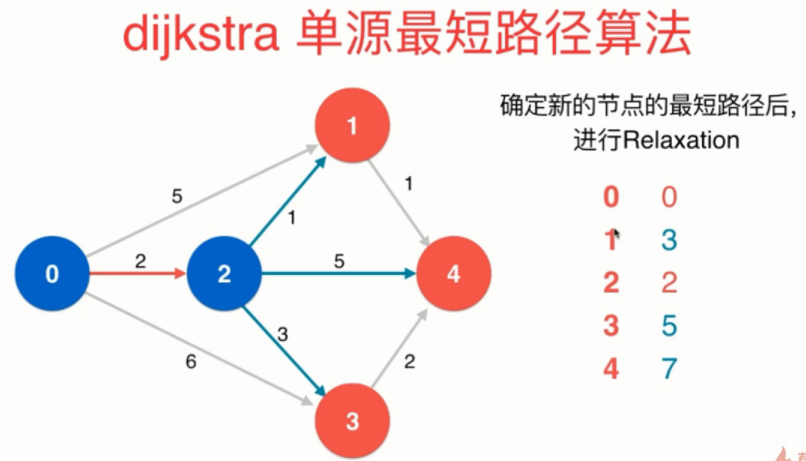
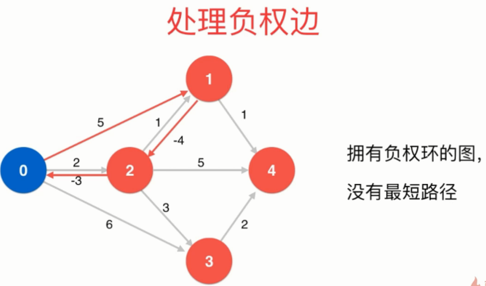
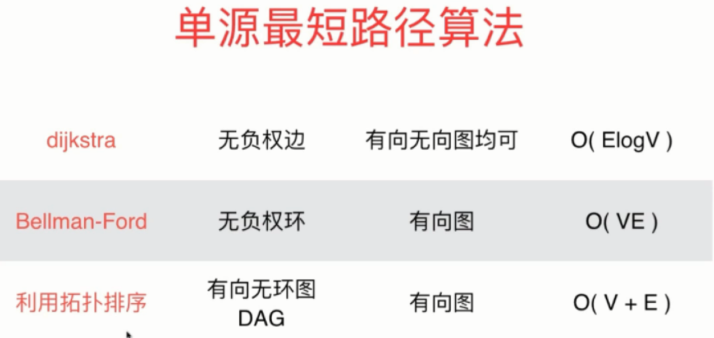

### 单源最短路径问题

#### 无权图最短路径

#### 有权图最短路径

> 松弛操作是最短路径求解的核心

### Dijkstra 单源最短路径算法
- 前提：图中不能有负权边

#### Dijkstra 算法流程

Dijkstra
1. 将顶点 0 进行标识，并作为当前顶点
1. 对当前顶点 0 的所有相邻顶点依次进行松弛操作，同时更新列表。从列表的未标识顶点中找到当前最短距离最小的顶点，即顶点 2，就可以说，起始顶点 0 到顶点 2 的最短路径即 0 -> 2。因为：图中没有负权边，即便存在从顶点 1 到顶点 2 的边，也不可能通过松弛操作使得从起始顶点 0 到顶点 2 的距离更小。
1. 对当前顶点 2 的相邻顶点 1 进行松弛操作，同时更新列表
1. 对当前顶点 2 的相邻顶点 4 进行松弛操作，同时更新列表
1. 对当前顶点 2 的相邻顶点 3 进行松弛操作，同时更新列表
1. 从列表的未标识顶点中找到当前最短距离最小的顶点，即 顶点 1，就可以说，起始顶点 0 到顶点 1 的最短路径即 0 -> 2 -> 1
1. 将顶点 1 进行标识，并作为当前顶点
1. 对当前顶点 1 的相邻顶点 4 进行松弛操作，同时更新列表
1. 从列表的未标识顶点中找到当前最短距离最小的顶点，即顶点 4，就可以说，起始顶点 0 到顶点 4 的最短路径即 0 -> 2 -> 1 -> 4
1. ......

> 图中没有负权边保证：对当前顶点的所有相邻顶点依次进行松弛操作后，只要能从列表的未标识顶点中找到当前最短距离最小的顶点，就能确定起始顶点到该顶点的最短路径。

#### Dijkstra 算法的过程总结：

1. 从起始顶点开始
1. 对当前顶点进行标识
1. 对当前顶点的所有相邻顶点依次进行松弛操作
1. 更新列表
1. 从列表的未标识顶点中找到当前最短距离最小的顶点，作为新的当前顶点
1. 重复第二步至第五步，直到列表中不存在未标识顶点

其实 Dijkstra 算法主要做两件事情：
1. 从列表中找最值
1. 更新列表

显然，**借助最小索引堆作为辅助数据结构**，就可以非常容易地实现这两件事情

#### Dijkstra 复杂度
**Dijkstra 算法时间复杂度：O(ElogV)**

### Bellman-Ford 单源最短路径算法

- 前提：图中不能有负权环
- Bellman-Ford 可以判断图中是否有负权环

#### Bellman-Ford 算法基本思想

#### Bellman-Ford 单源最短路径算法时间复杂度
- Bellman-Ford 单源最短路径算法时间复杂度：O(EV)

参考：
- [Dijkstra](https://www.cnblogs.com/siwuxie095/p/7135594.html#4004947)
- [Bellman-Ford](https://www.cnblogs.com/siwuxie095/p/7135598.html)

### 更多
- 具体实现：distTo[i]初始化为“正无穷”
- Bellman-Ford 算法优化：利用队列数据结构：Queue-based Bellman-Ford算法
- 单源最短路径算法：

- 所有对最短路径算法：Floyed 算法，处理无负权环的图O(V * V * V)
- 最长路径算法：

