### 哈希函数

#### 哈希函数的设计

- "键"通过哈希函数得到的"索引"分布越均匀越好
- 对于一些特殊领域，有特殊领域的哈希函数设计方式，甚至有专门的论文

##### 整型

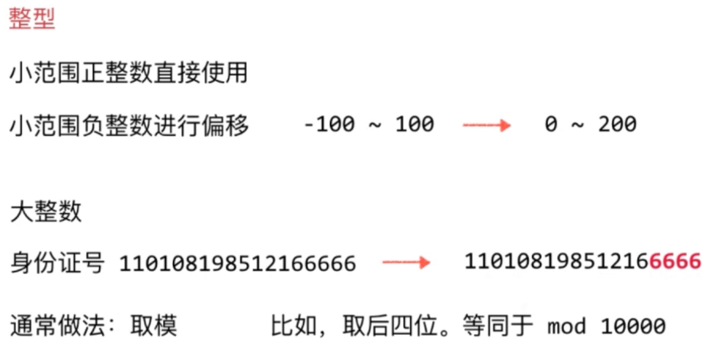

##### 大整型

**取模**

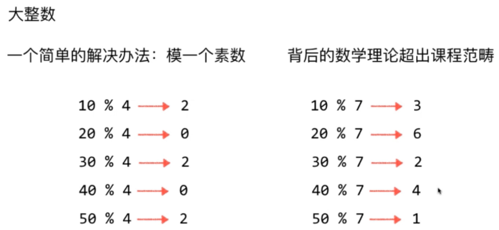

##### 浮点型

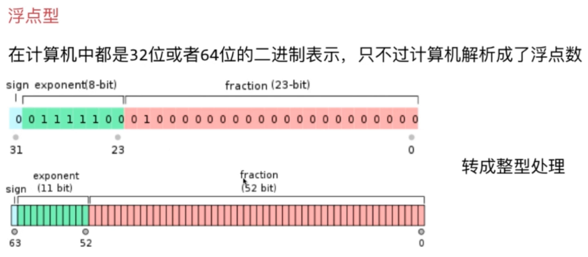

##### 字符串

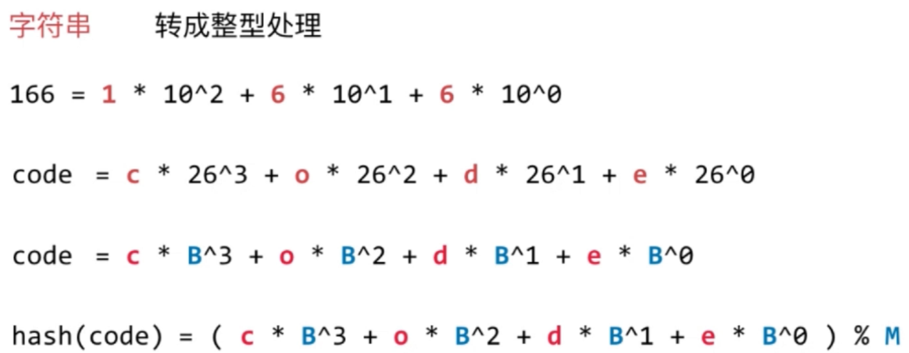

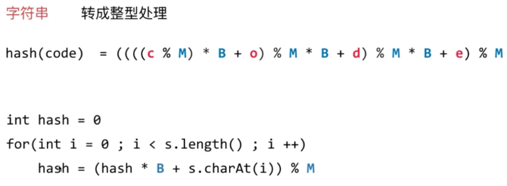

##### 复合类型

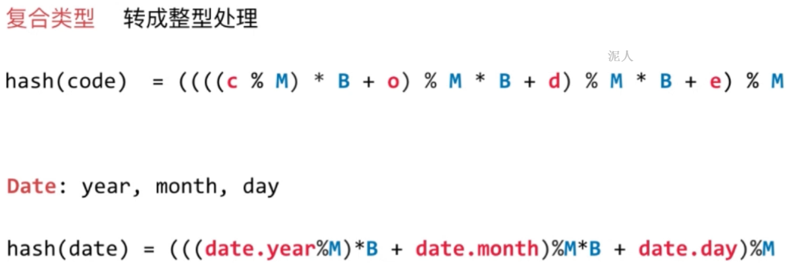

> 原则：
1. 一致性：hash(a) == hash(b)
1. 高效性：计算高效简便
1. 均匀性：哈希值均匀分布

#### 哈希冲突的处理

##### 链地址法

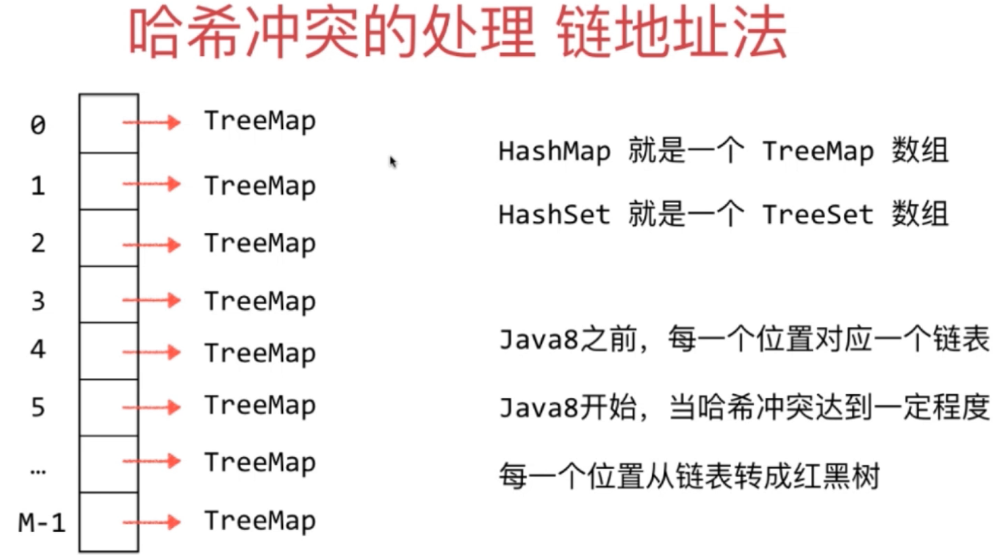

> 去除符号位：(hashCode(k1) & 0x7fffffff) % M

##### 时间复杂度和动态扩容

- 时间复杂度
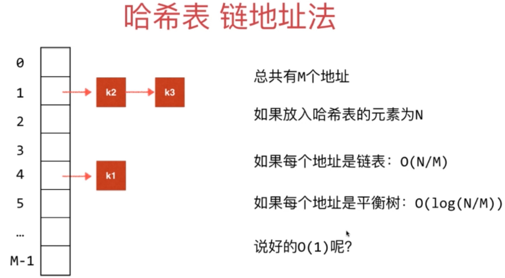

- 动态扩容
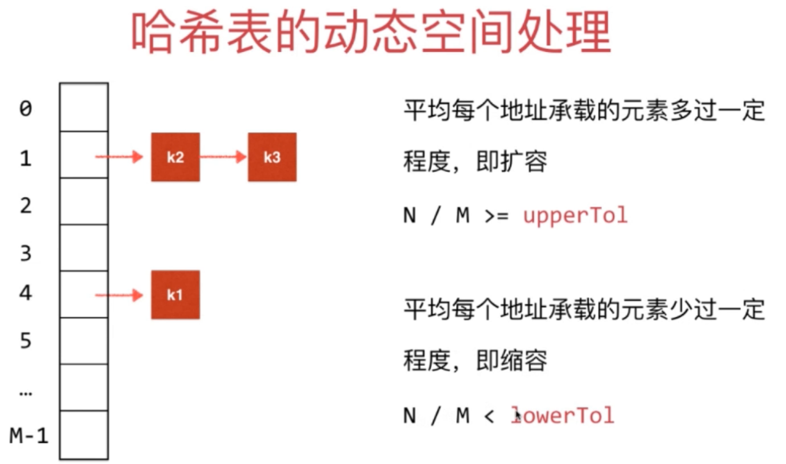s

#### 哈希表时间复杂度分析

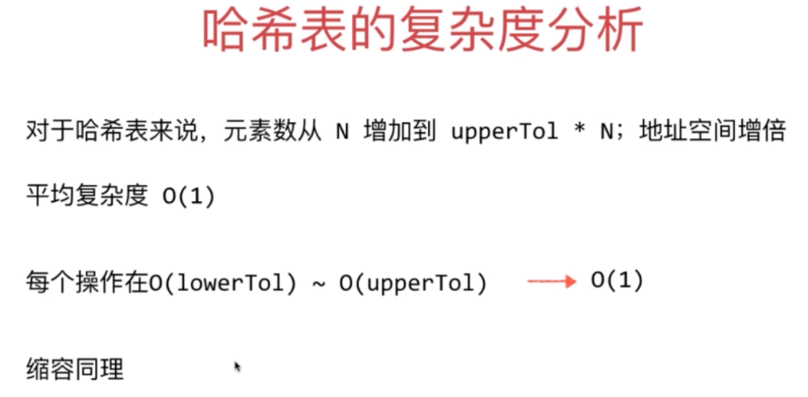

#### 更复杂的扩容操作

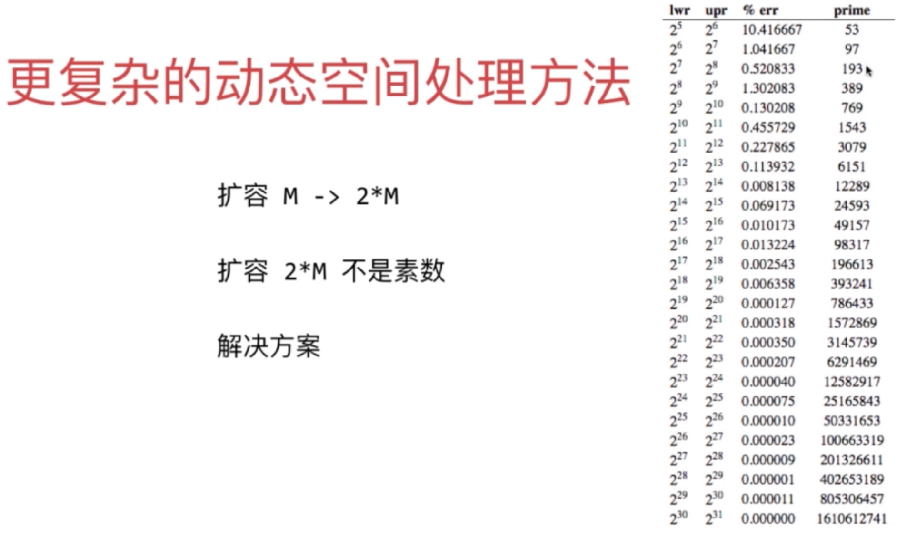

#### 哈希表

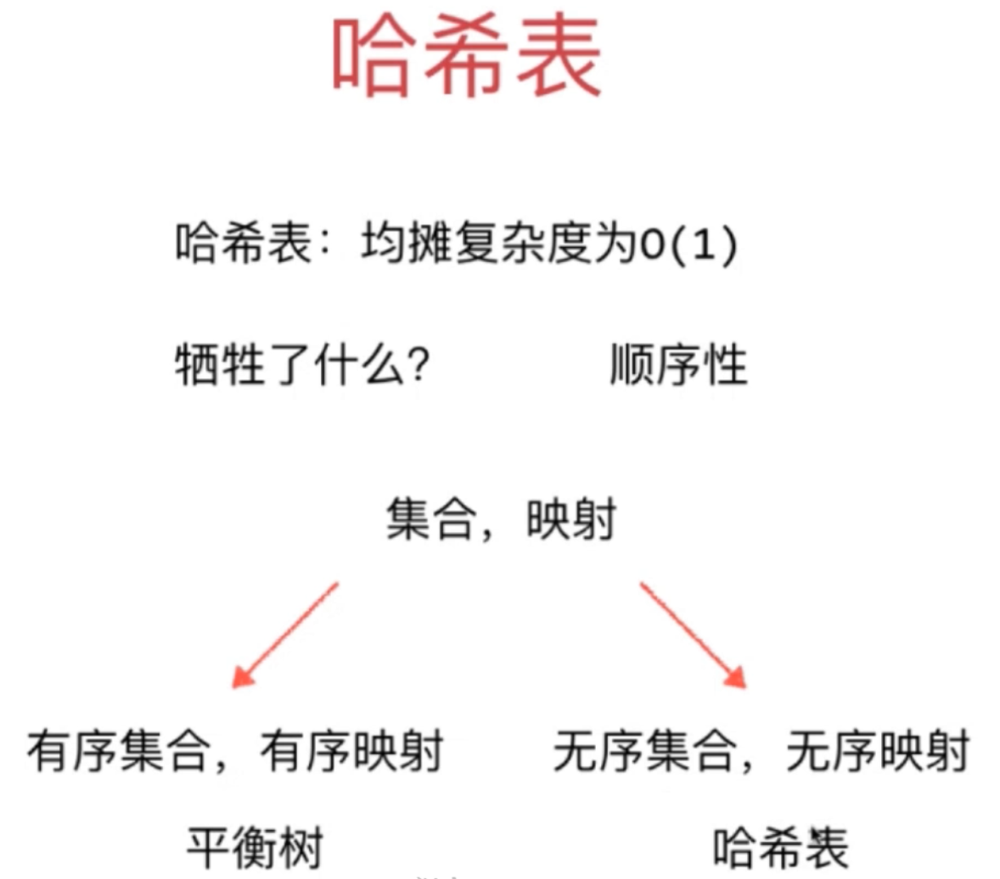

#### 更多冲突处理方法

- 开放地址法：
    - 线性探测：遇到哈希冲突 + 1
    - 平方探测：遇到哈希冲突 + 1，+ 4，+ 9，+ 16
    - 二次哈希：遇到哈希冲突 hash2(key)
- 再哈希法：Rehashing
- Coalesced Hashing：separate chaining 和 open addressing

