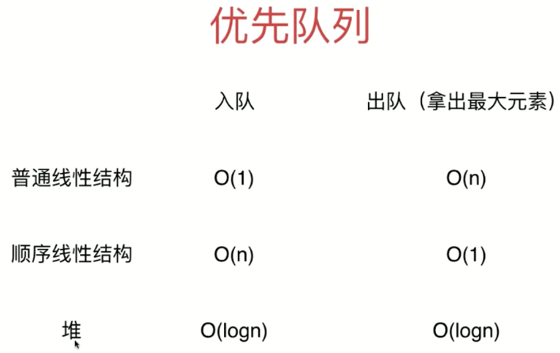
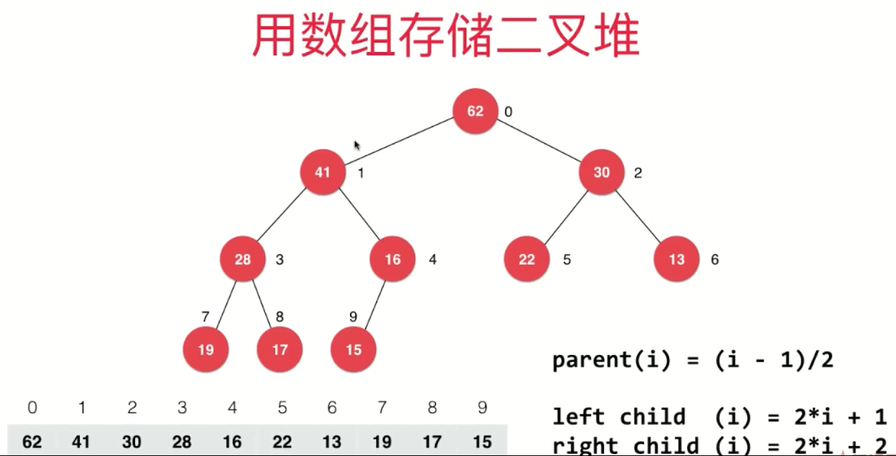
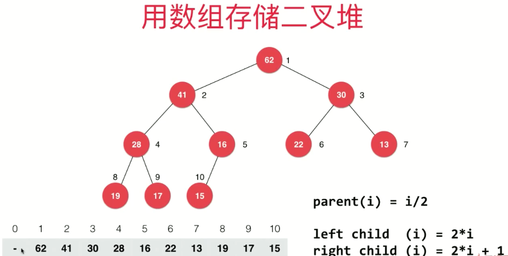
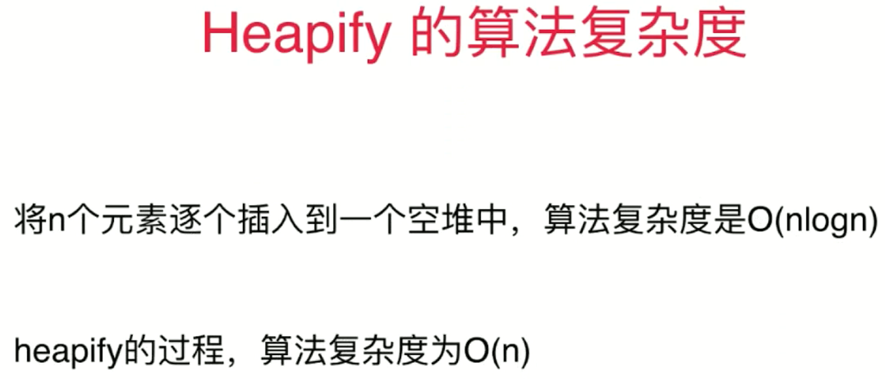
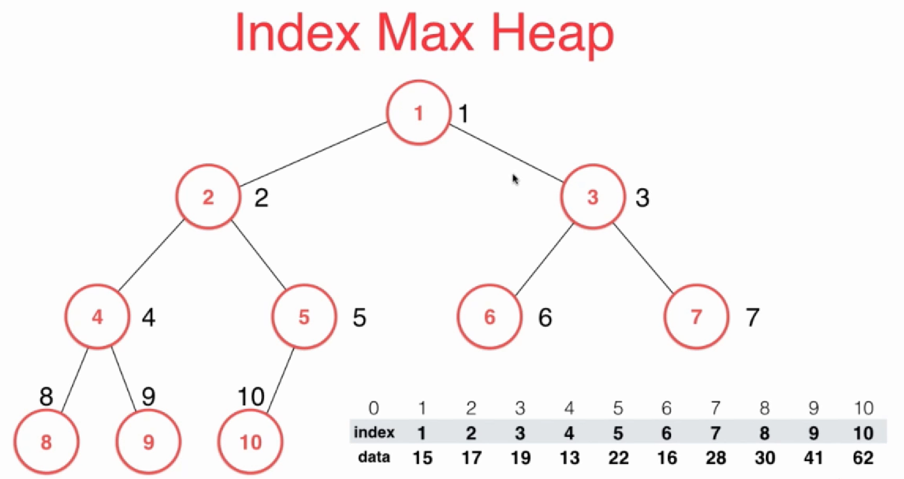
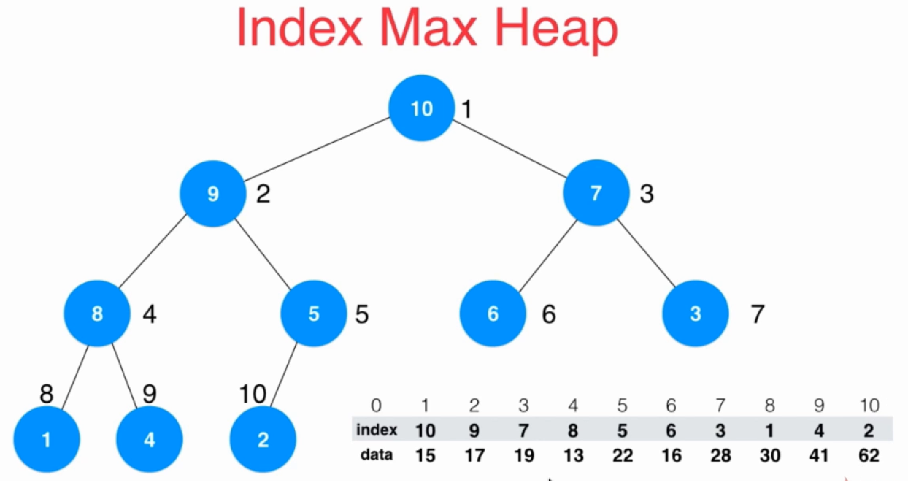
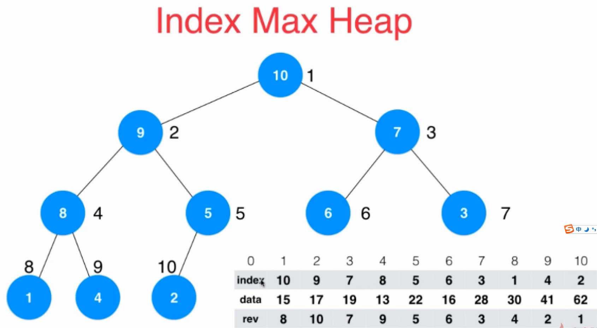
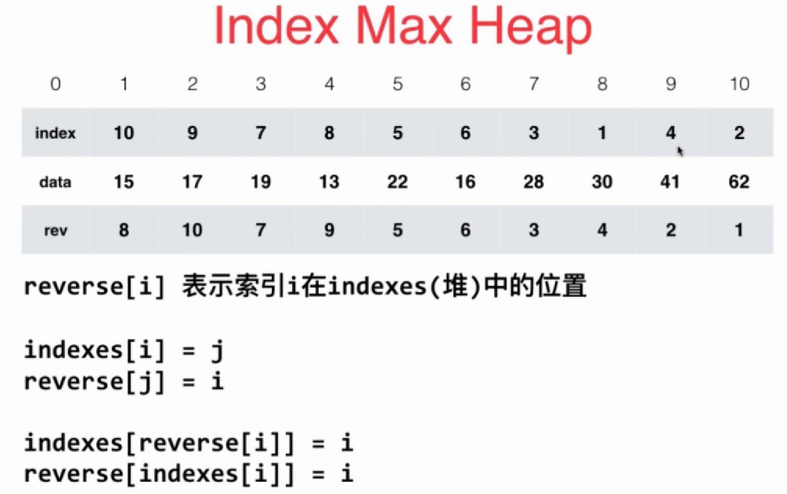
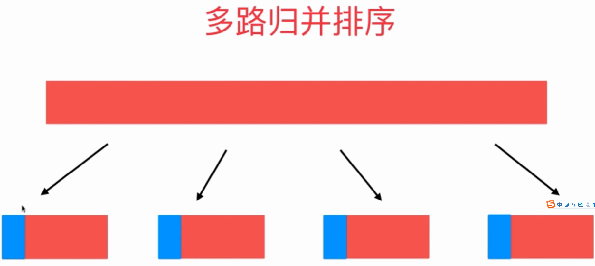
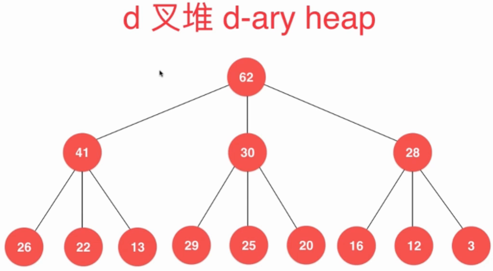

### 优先队列
- 普通队列：先进先出；后进后出
- 优先队列：出队顺序和入队顺序无关；和优先级有关
    - 动态选择优先级最高的任务执行
- 优先队列复杂度
    
> 不像二分搜索树是平均复杂度为 O(logN)，堆是在最坏情况下复杂度为O(logN)
### 堆
- 二叉堆
    - 一棵完全二叉树
    - 堆中某个节点值总是不大于其父节点的值
    - 最大堆（根节点值最大），最小堆（根节点值最小）
- 用数组存储二叉堆
    - 索引从0开始
    
    - 索引从1开始
    
    - 二叉堆 add 和 extractMax 时间复杂度都为 O(logN) 即 O(height)，对于堆来说是完全二叉树，因此永远不可能退化为链表
- Shift Up
- Shift Down
- Heapify 复杂度
    
### 堆排序
#### 原地堆排序
1. 从小到大排序，则通过 Heapify 形成**最大堆**
1. 交换堆顶元素、数组末尾元素，即将最大元素放到数组末尾去
1. 对新的堆顶元素进行Shift Down操作，再次形成最大堆
1. 交换堆顶元素和数组倒数第二个元素，依次类推
1. ...

> 原地堆排序时间复杂度：O(NlogN)，空间复杂度为 O(1)

### 索引堆

- 索引堆中实际存放的是data数组原先的索引；因此，在做元素比较时，比较的是data，在做元素交换时交换的是索引index

- 维护好rev数组，更新索引时就能以 O(1) 时间复杂度找到data数组索引在index数组中（堆中）的位置

### 堆相关问题

- 使用堆实现优先队列
    - 动态选择优先级最高的任务执行
    - 游戏AI：攻击范围内优先攻击
    - 在N个元素中选出前M个元素：NlogM（最小堆）
- 多路归并排序

- d叉堆

- 堆的实现细节优化
    - ShiftUp和ShiftDown使用赋值替换swap
    - 堆数组从0开始索引
    - 动态调整堆数组大小
- 堆实现的最大最小队列（数据结构中既维护一个最大堆又维护一个最小堆，维护同样一组数据）
- 二项堆、斐波那契堆
