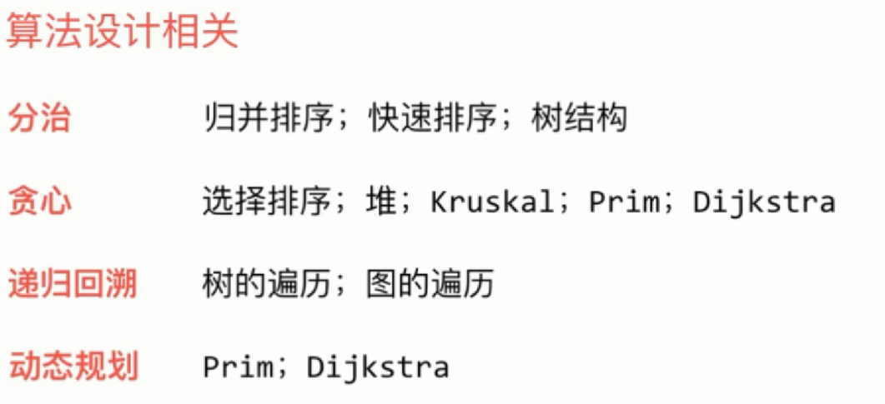

### 数据结构

#### 基本数据结构

- 线性问题（排序）
    - O(N*N)：选择排序、插入排序
    - O(NlogN)：归并排序、快速排序、三路快排
                        partition -> 随机化 -> 大量重复元素
    - 应用：求逆序对个数、k-selection
- 树形问题
    - 堆：堆排序、优先队列、索引堆（prim、Dijkstra）
    - 二叉查找树：解决查找问题
    - 并查集：基于rank优化 -> 路径压缩 kruskal
- 图论问题
    - 图的表示：邻接表和邻接矩阵
        - 有向图和无向图 有权图和无权图
    - 图的遍历：DFS、BFS
        - 联通分量、Flood Fill、寻路、走迷宫、迷宫生成、无权图的最短路径、环的判断
    - 最小生成树问题：Prim、Kruskal
    - 最短路径问题：Dijkstra、Bellman-Ford
#### 抽象数据结构

#### 更多数据结构

#### 算法设计相关
