### 红黑树

#### 算法导论中的红黑树
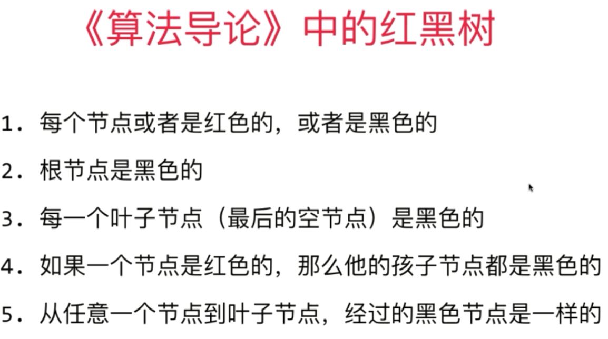

**红黑树 等价于 2-3树**

#### 2-3树
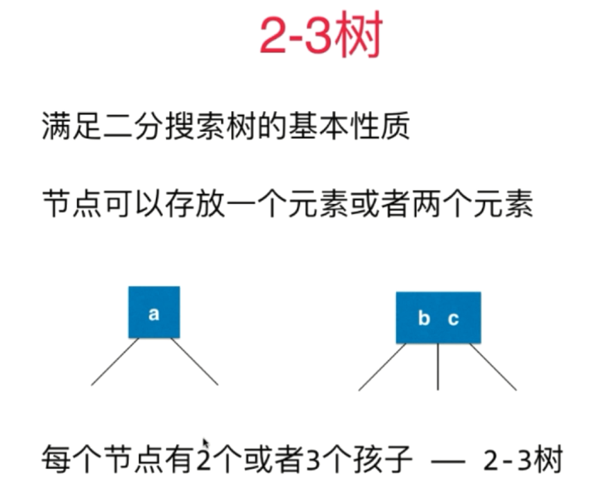

- 2-3树是一棵绝对平衡的树

> **2-3树新节点永远不会添加到空节点处，而是和最后一个叶子节点融合**

- 2-3树添加节点过程
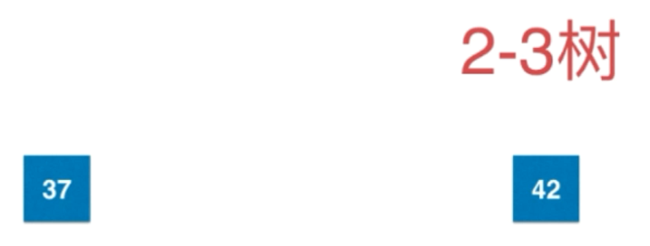

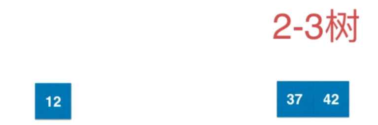

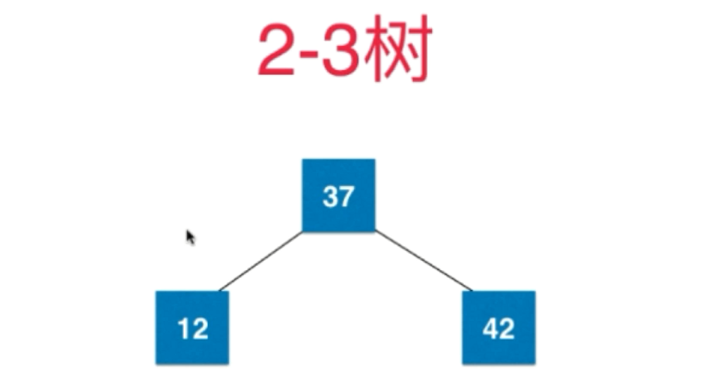
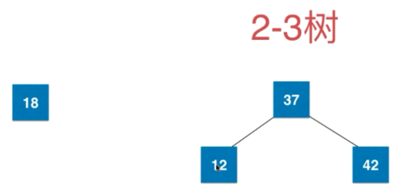
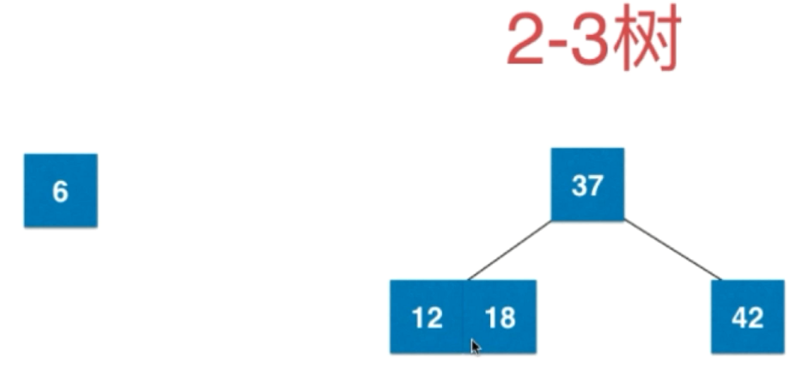
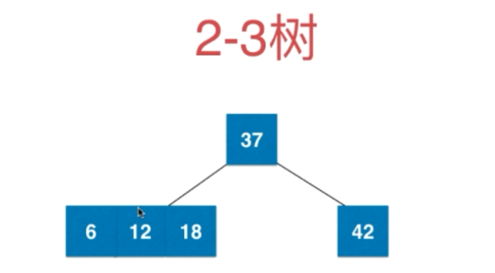
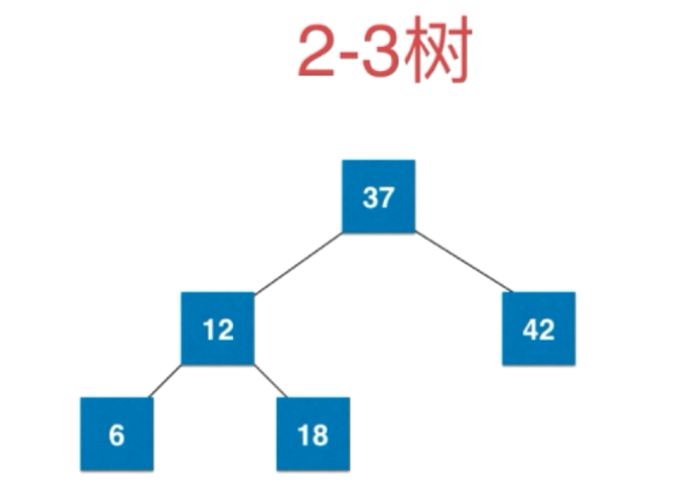
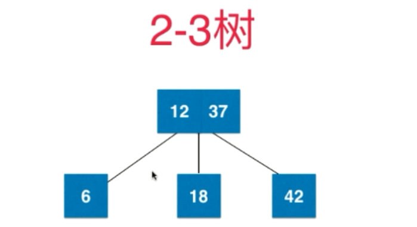
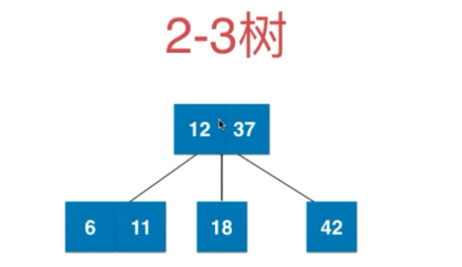
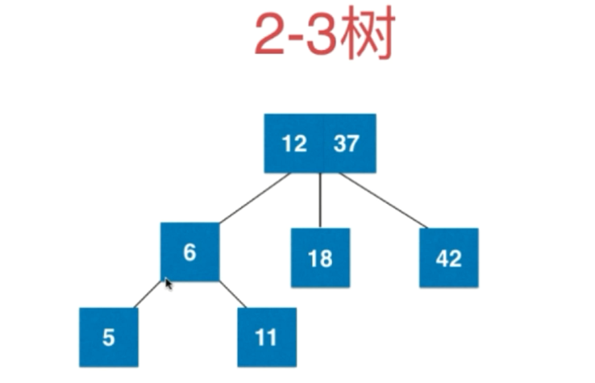
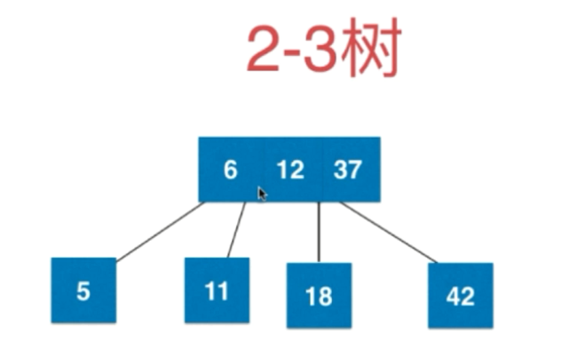
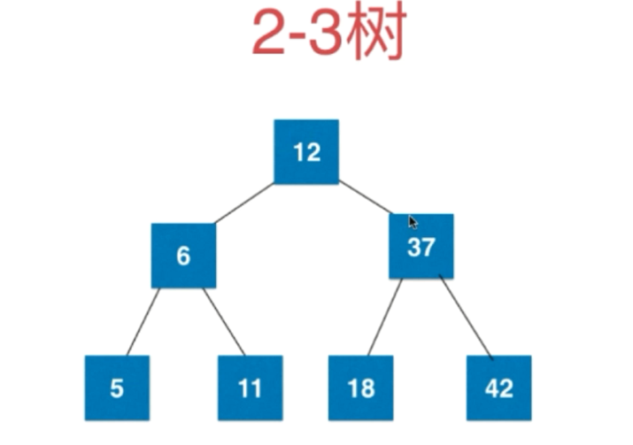

##### 如果插入2-节点
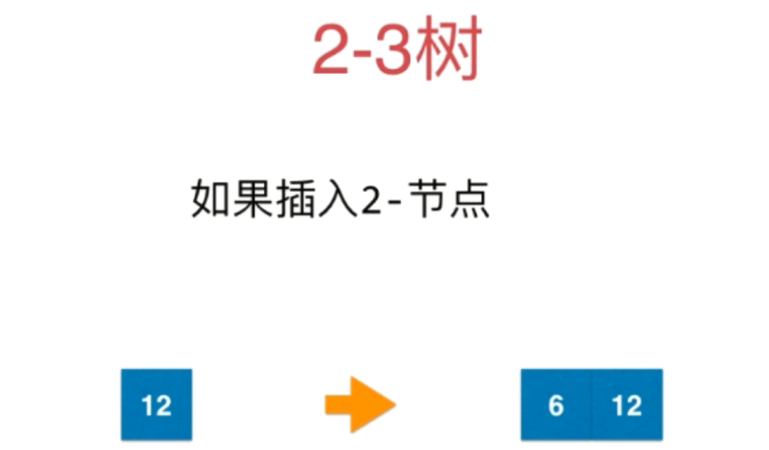

##### 如果插入3-节点
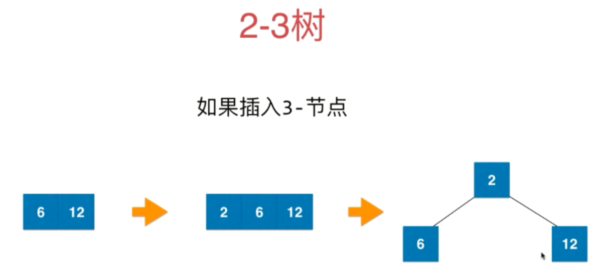

##### 如果插入3-节点是叶子节点，父节点为2-节点
1. 形成临时 4-节点
1. 拆成 3 个 2 节点的临时子树
1. 向上融合
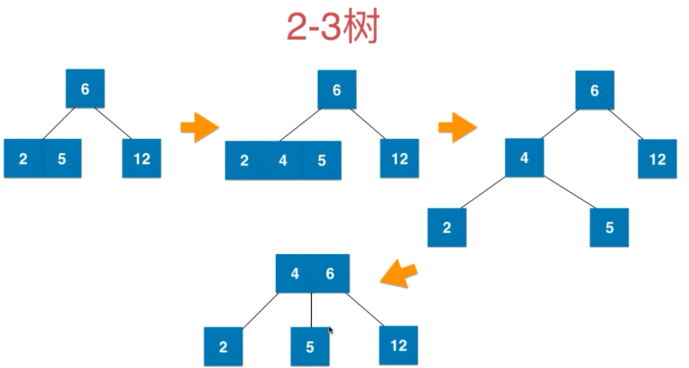

##### 如果插入3-节点，父节点为3-节点
1. 形成临时 4-节点
1. 拆成 3 个 2 节点的临时子树
1. 向上融合，父节点变成临时 4-节点
1. 4-节点拆成 3 个 2 节点
1. 向上融合
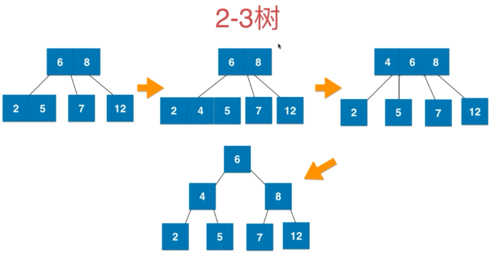

#### 红黑树和2-3树的等价性
引入红色节点，即和父节点一起表示原来在2-3树中的3节点
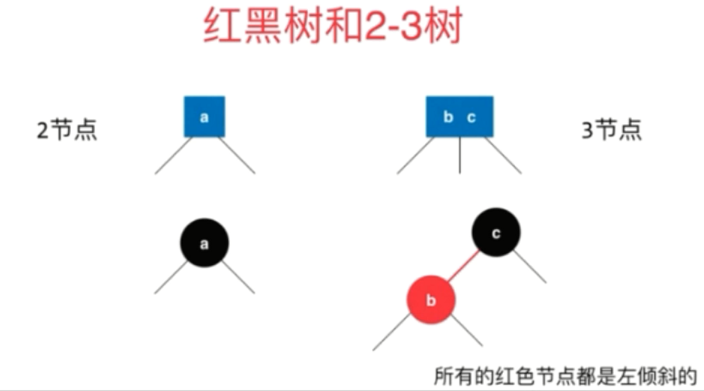

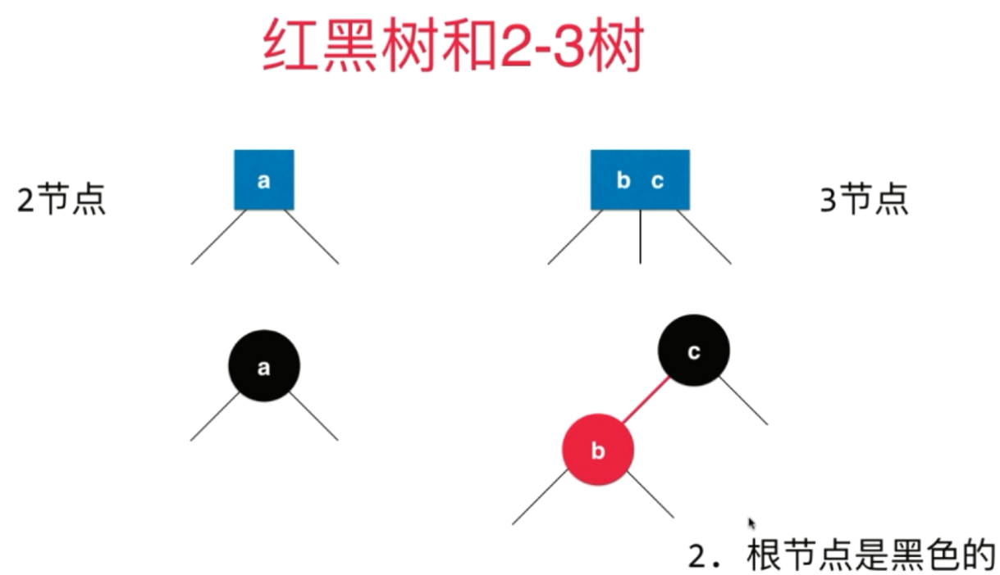

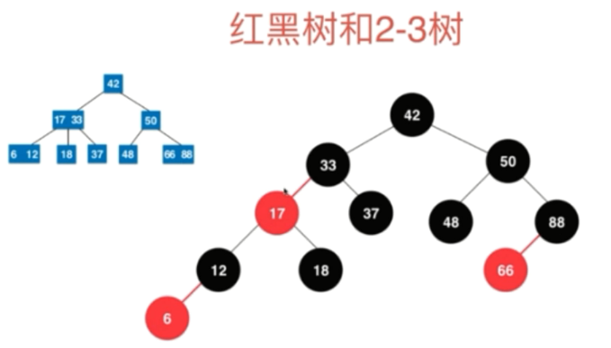

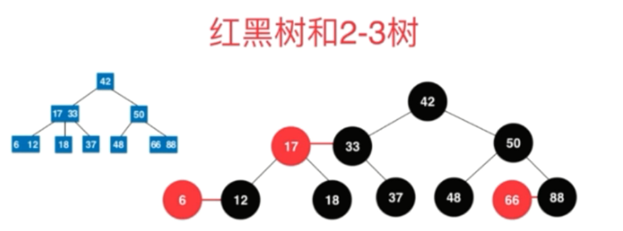

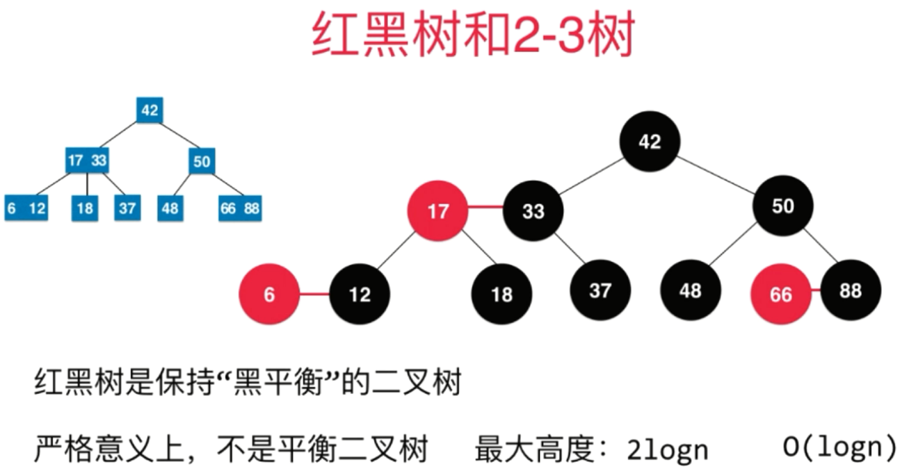

#### 红黑树特性
1. 每个节点或者是红色，或者是黑色
1. 根节点是黑色
1. 每个叶子节点（最后的空节点）是黑色的
1. 如果一个节点是红色的，那么他的孩子节点都是黑色的
5. 从任意一个节点到叶子节点，经过的黑色节点是一样的

#### 红黑树添加新元素

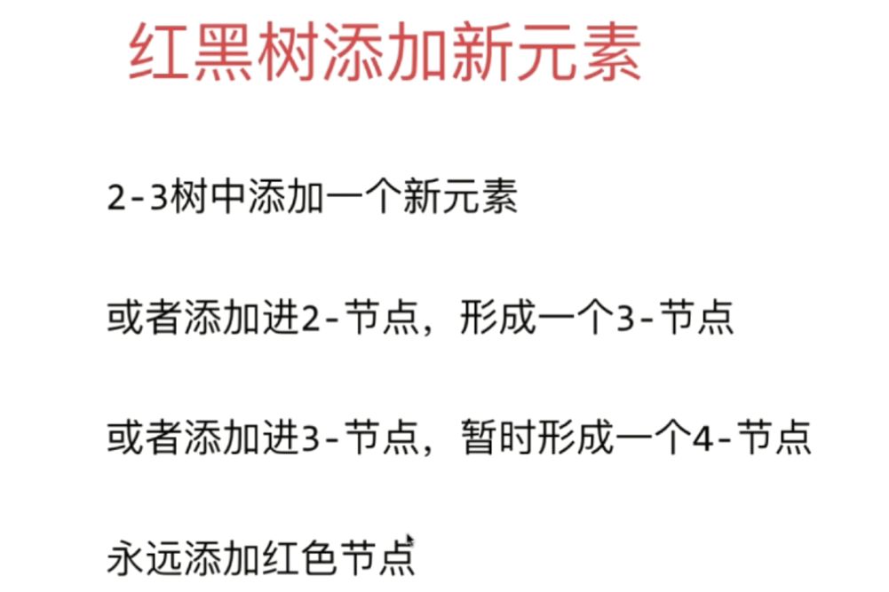
> 永远添加红色结点，等价于2-3树中每次添加新节点都要和已有节点融合，若破坏平衡性再调整即可

红黑树擅长插入、删除

#### 红黑树的性能总结

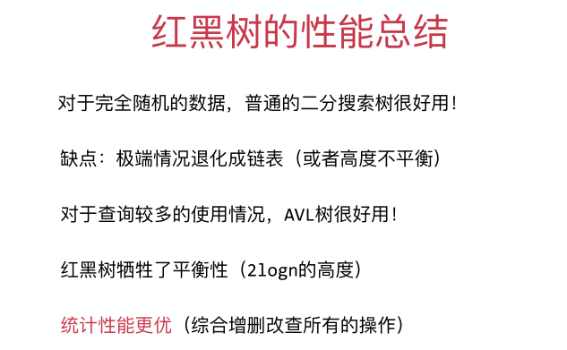

#### 更多

- 左倾红黑树、右倾红黑树
- 统计性能优秀的树结构 ：Splay Tree（伸展树）
    - 局部性原理理：刚被访问的内容下次高概率被再次访问
- java.util中的 TreeMap 和 TreeSet 基于红⿊树
- 对于红黑树，任何不平衡都会在三次旋转内解决。（左倾红黑树不成立，因为红黑树的标准定义中没有规定红节点一定左倾）