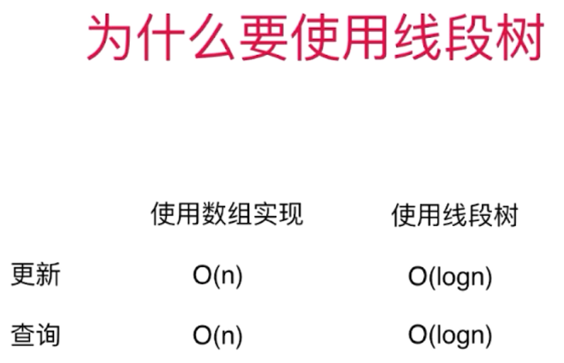
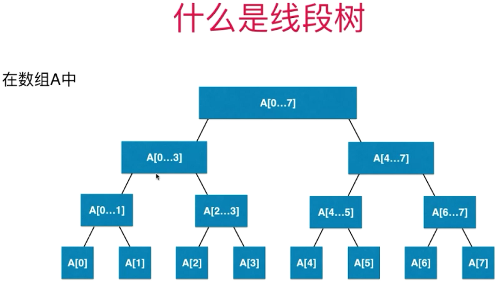
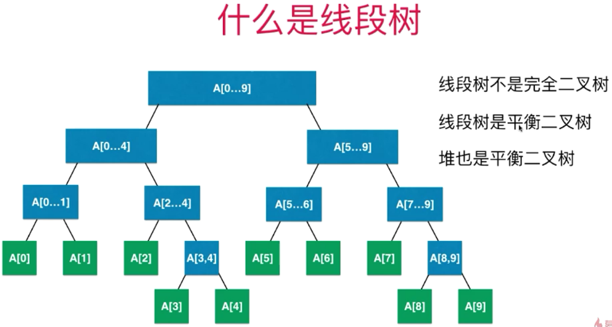
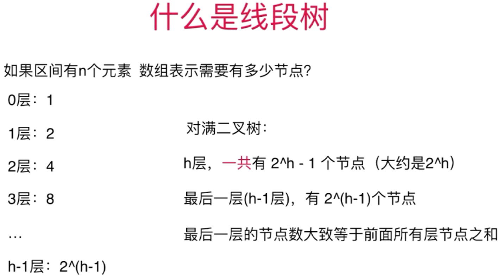
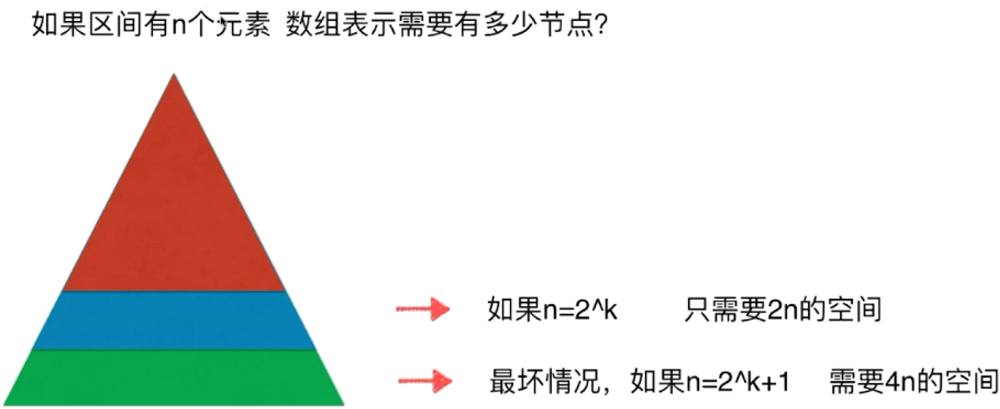
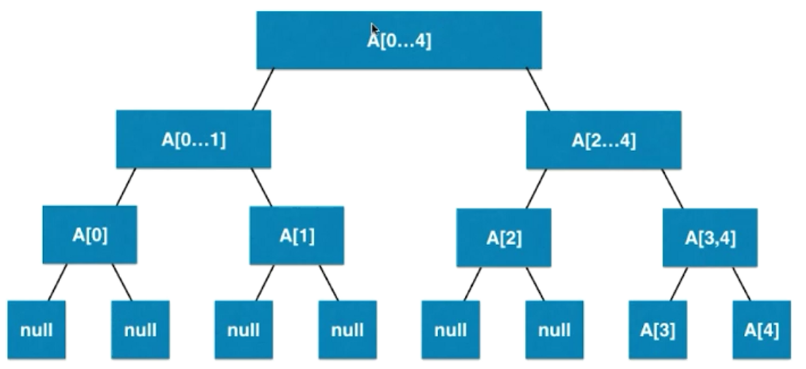
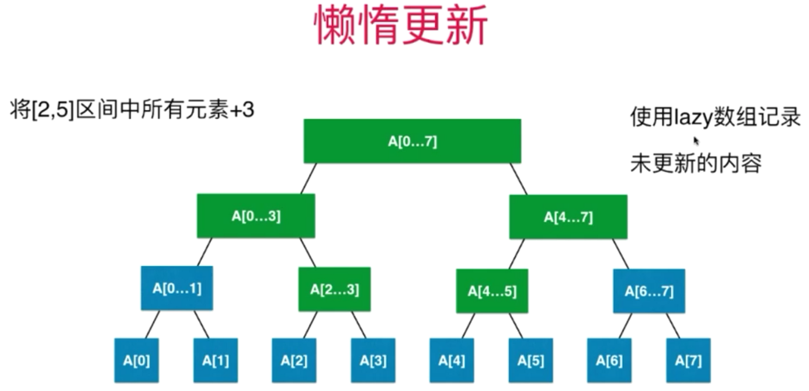
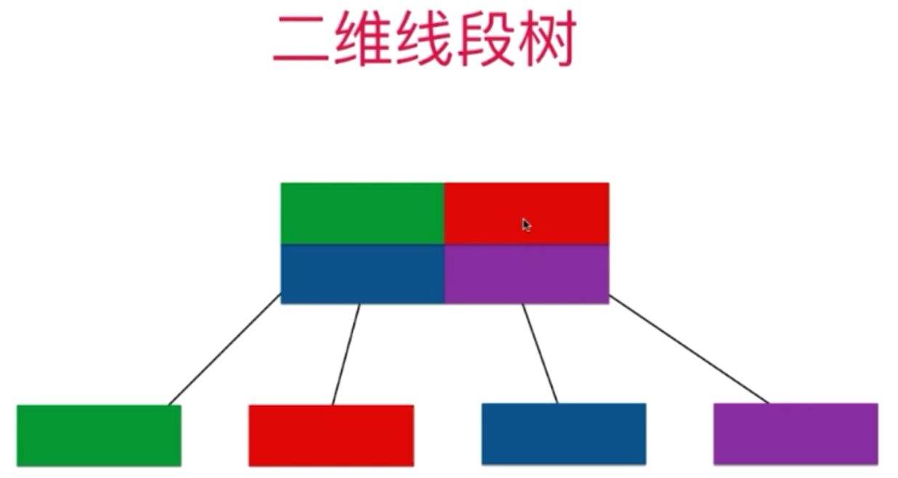
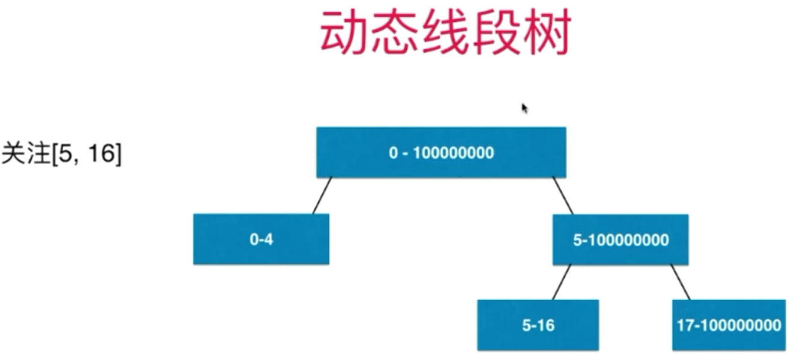

### 线段树
#### 为什么使用线段树

> 只考虑数组区间固定

#### 什么是线段树

- 如果区间有 n 个元素，数组表示需要多少个节点？

    
    
    
    
    - 看成满二叉树：
    
    

> 如果区间有 n 个元素，数组表示需要有多少个节点？ 需要 4n 的空间。（不考虑添加元素，即区间固定，使用 4n 静态空间即可）

#### 更多
- 懒惰更新

- 二维线段树

- 动态线段树

- 区间操作相关另外一个重要数据结构
    - 树状数组：Binary Index Tree
- 区间相关问题
    - RMQ：Range Minimum Query

