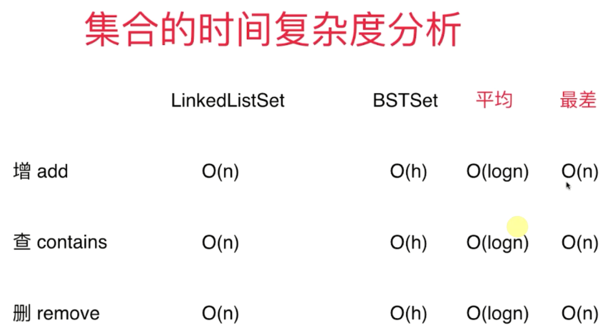
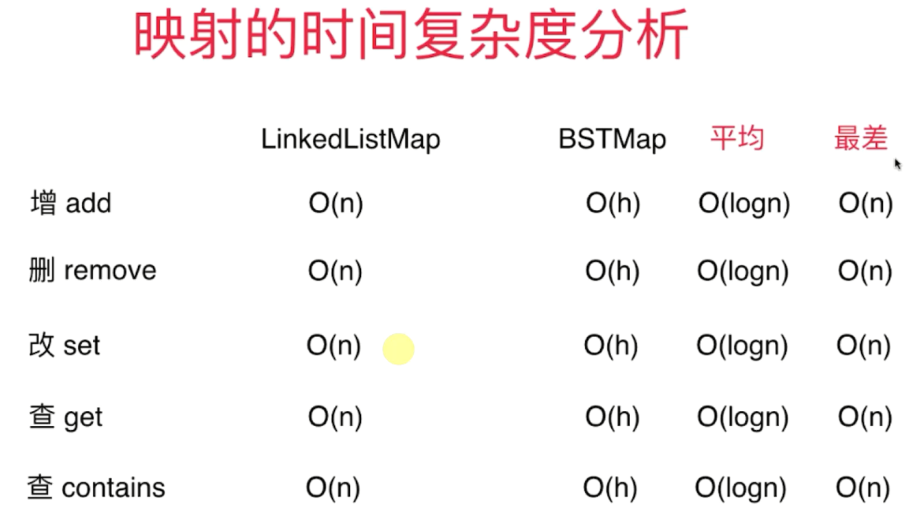

### 集合
- 有序集合的元素具有顺序性：
    - 基于搜索树实现
    - 能找到最大最小，由大到小遍历，前驱后继等，如二分搜索树BST和Java里的TreeSet（红黑树实现）
- 无序集合的元素没有顺序性：链表实现
    - 基于哈希表实现
- 多重集合
    - 元素可以重复：节点可增加count属性等
- Set 时间复杂度分析
    
### 映射
- Key 不重复
- 有序映射
    - 基于搜索树
- 无序映射
    - 基于哈希表
- 多重映射
- Map 时间复杂度分析
    

> 映射本质也可看成集合，需要添加一些额外操作；更常见是基于映射包装出集合，此时将Value看成空的

