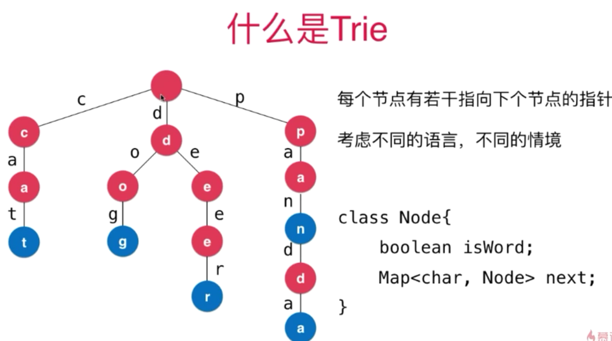
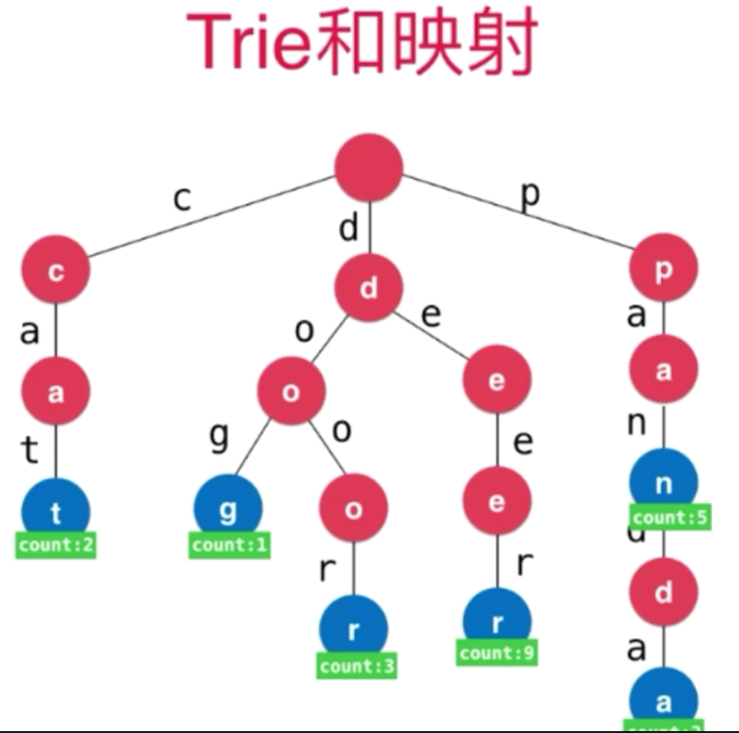
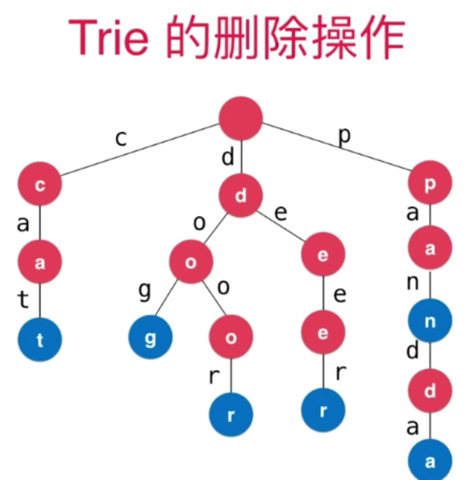
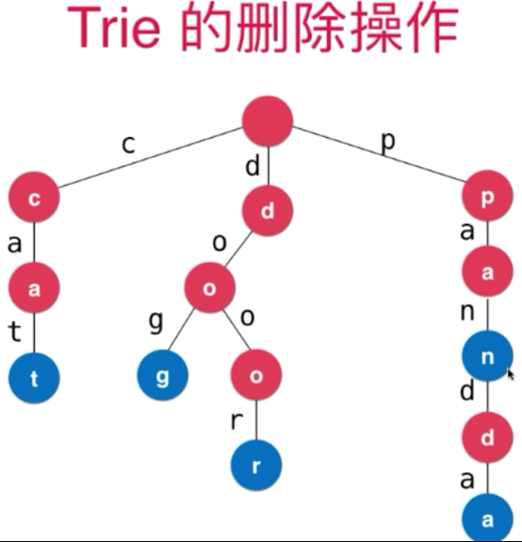
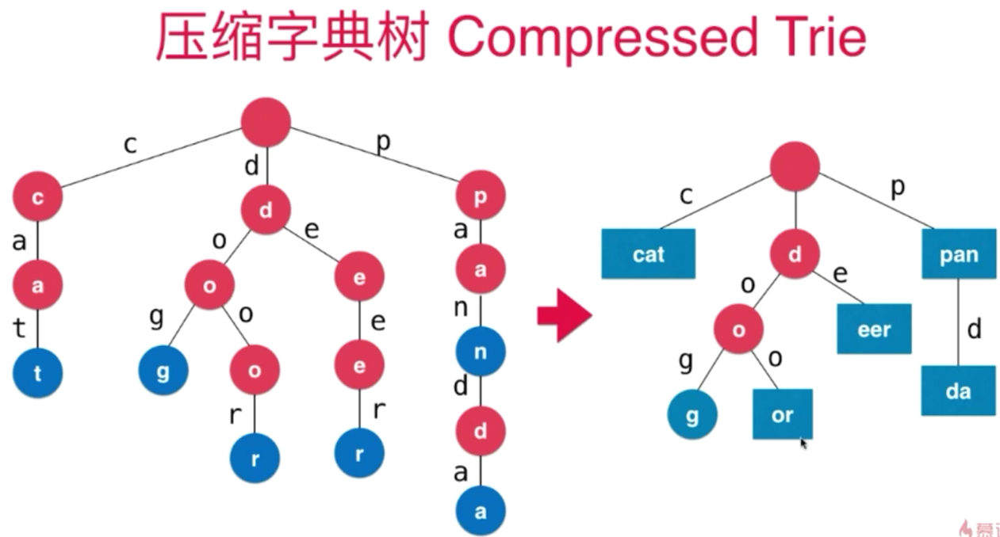
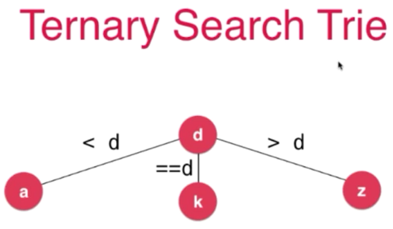
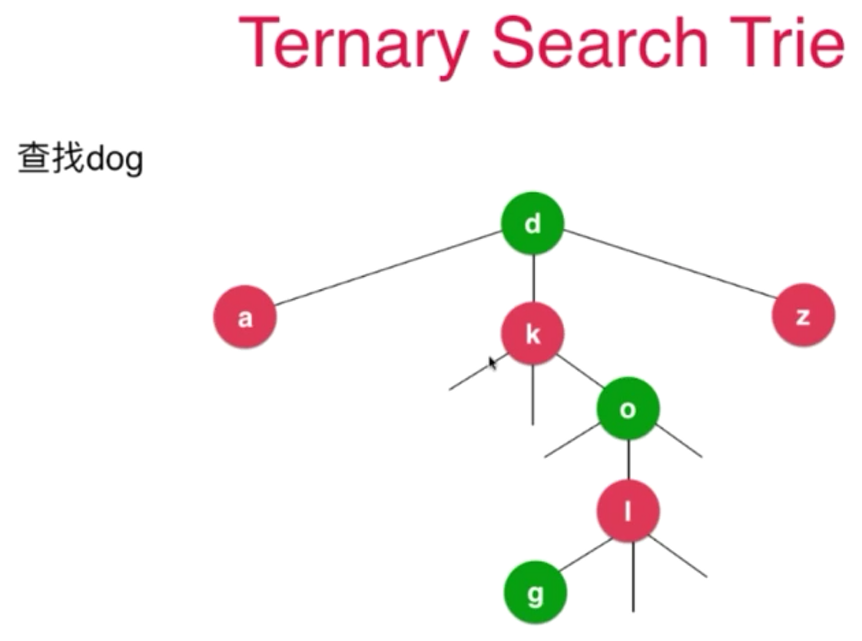

### Trie（字典树、前缀树）
#### 什么是Trie

#### Trie和映射
- Trie和映射
    

#### 更多
- Trie删除操作
    
    
    
- Trie的局限性：空间
    - 压缩字典树
    
- 三分搜索树 Ternary Search Tree
    
    
    
- 字符串模式识别：后缀树
- 子串查询：
    - KMP
    - Boyer-Moore
    - Rabin-Karp
- 文件压缩
- 模式匹配
- 编译原理
- DNA